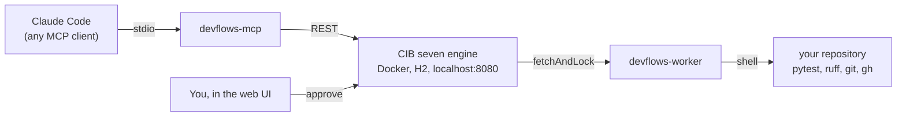
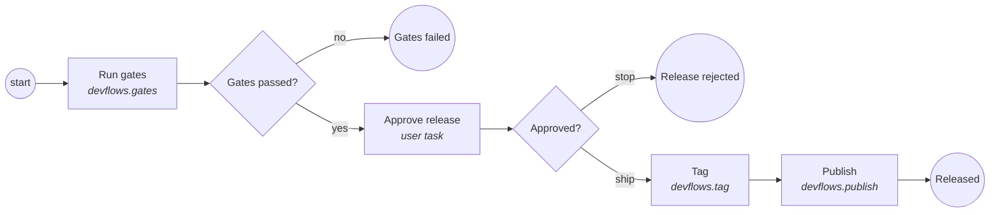

# cibseven-devflows

Run your developer workflows as BPMN processes on a local [CIB seven](https://cibseven.org) engine,
and drive them from AI coding agents such as Claude Code through an MCP server.

Version 0.1.0 ships one workflow: the **release ritual** of a repository. Run the quality gates,
ask a human, tag, publish. This repository cut its own `v0.1.0` by running that process on itself.

## Why

Cutting a release is a process with a human decision in the middle of it. Normally that process
lives in someone's head and in a terminal scrollback. Nothing records that the gates ran, that a
person approved, or what was published.

A process engine is exactly the right tool for that shape of problem. CIB seven keeps the state,
keeps the history, and knows how to wait for a human. Your machine still does the work, and an AI
agent can start a run and watch it, but it cannot skip the approval, because the approval is a step
in the process rather than a promise in a prompt.

## Architecture



The engine never runs a shell command and never touches your repository. It hands out work; the
worker on your machine polls for it and does it. That is the standard Camunda 7 **external task**
pattern, and it is what makes it safe to let a process drive a developer machine.

## The release process



The three rectangles with a topic name are external tasks. "Approve release" is a BPMN user task,
so it waits, it survives an engine restart, and it can be answered either in the web UI or through
the `approve_gate` MCP tool.

`dry_run=true` runs the gates for real and changes nothing else: no tag, no push, no release.

## Quickstart

```bash
docker compose -f engine/docker-compose.yml up -d
```

```bash
uv sync
```

```bash
uv run pytest -m "not integration" && uv run ruff check .
```

Deploy the process (once per engine):

```bash
curl -s -X POST http://localhost:8080/engine-rest/deployment/create -F "deployment-name=cibseven-devflows" -F "release.bpmn=@processes/release.bpmn"
```

Start the worker and leave it running in its own terminal:

```bash
uv run devflows-worker
```

Start a dry release of this repository. Replace `repo_path` with this repository's absolute path.
Use forward slashes even on Windows (`C:/Users/you/repos/cibseven-devflows`): they work, and they
save you from fighting your shell over backslash escaping.

```bash
curl -s -X POST http://localhost:8080/engine-rest/process-definition/key/devflows-release/start -H "Content-Type: application/json" -d '{"variables":{"repo_path":{"value":"ABSOLUTE/PATH/TO/cibseven-devflows","type":"String"},"version":{"value":"0.2.0","type":"String"},"dry_run":{"value":true,"type":"Boolean"}}}'
```

Then approve it at <http://localhost:8080/webapp/#/seven/auth/tasks> as `demo` / `demo`:
filter **My Group Tasks**, claim **Approve release**, tick approve, submit.

In practice you start runs through the MCP server instead of curl. See
[docs/DEMO.md](docs/DEMO.md) for the full walkthrough.

## `devflows.yaml`

Each repository describes its own release in a `devflows.yaml` at its root:

```yaml
gates:
  - name: tests
    run: uv run pytest -q
  - name: lint
    run: uv run ruff check .

tag:
  format: "v{version}"

publish:
  run: gh release create v{version} --generate-notes
```

| Key | Meaning |
| --- | --- |
| `gates` | Ordered list of quality gates. Each needs a `name` and a shell command in `run`. The first non-zero exit code ends the release. |
| `tag.format` | How the tag name is built. `{version}` is the only placeholder. Optional; defaults to `v{version}`. |
| `publish.run` | The shell command that publishes the release. `{version}` is the only placeholder. |

Unknown top-level keys are ignored, so a newer version of devflows can add steps without breaking
an older file.

## The MCP tools

`devflows-mcp` speaks MCP over stdio and works from any MCP client.

| Tool | Arguments | Returns |
| --- | --- | --- |
| `engine_status` | — | Whether the engine answers, its version, its engine names |
| `deploy_process` | `bpmn_path` (optional) | Deployment id and the deployed process definition keys |
| `list_processes` | — | Deployed process definitions with key, version and id |
| `start_release` | `repo_path`, `version`, `dry_run` (default `true`) | Process instance id and a link to it in the web UI |
| `get_run` | `process_instance_id` | State, current activity, open tasks, the gate report, all variables |
| `list_gates` | `repo_path` | The gates that repository would run. Does not touch the engine |
| `approve_gate` | `task_id`, `approve`, `comment` | Confirmation that the approval task was completed |

Every tool returns a dictionary with an `ok` flag, and an `error` string when `ok` is false.
No tool raises, because the caller is a language model that has to explain the failure to a person.

## Using it from Claude Code

`plugin/` is a Claude Code plugin around the same server:

- `plugin/.mcp.json` starts `devflows-mcp` with `uv run`.
- `plugin/skills/release-with-devflows/SKILL.md` tells the agent when to use the engine and in what
  order to call the tools, including the rule that it must stop and ask before approving.
- `plugin/commands/release.md` provides `/devflows:release <version> [--real]`.

To wire the server into any other MCP client directly:

```json
{
  "mcpServers": {
    "cibseven-devflows": {
      "command": "uv",
      "args": ["run", "devflows-mcp"]
    }
  }
}
```

## Configuration

| Variable | Default | Used by |
| --- | --- | --- |
| `DEVFLOWS_ENGINE_URL` | `http://localhost:8080/engine-rest` | worker, MCP server |
| `DEVFLOWS_WORKER_ID` | `devflows-worker-<hostname>` | worker |
| `DEVFLOWS_LOCK_MS` | `300000` | worker |
| `DEVFLOWS_POLL_MS` | `10000` | worker |
| `DEVFLOWS_BPMN_PATH` | found next to the package | MCP server |

## Security

Two things about this project are deliberate, and both assume it runs on your own machine:

- **The engine has no authentication.** The REST API on `localhost:8080` accepts anything that can
  reach it. Do not expose that port to a network you do not control.
- **The worker runs shell commands.** They come from the `devflows.yaml` of the repository you
  asked it to release, they run as you, in that repository, and they are the same commands you
  would type. Only point it at repositories you trust.

There is no cloud service, no telemetry and no account beyond the GitHub credentials `gh` already
has.

## Repository layout

| Directory | What is in it |
| --- | --- |
| `engine/` | Docker Compose for a local CIB seven 2.2.0 engine |
| `processes/` | `release.bpmn`, the release ritual |
| `core/` | `devflows_core`: engine REST client, config parsing, shell step runner |
| `workers/` | `devflows_worker`: the external task worker |
| `mcp/` | `devflows_mcp`: the stdio MCP server |
| `plugin/` | The Claude Code plugin |
| `tests/` | Unit tests, plus `tests/integration/` which needs a live engine |
| `docs/` | The demo script, and the design and plan documents |

## Requirements

- Docker Desktop, for the engine
- Python 3.12 and [uv](https://github.com/astral-sh/uv)
- `git`, and `gh` authenticated, for the tag and publish steps
- Camunda Modeler 5.x if you want to edit the BPMN diagram (optional). Open `processes/release.bpmn`
  as a **Camunda 7** diagram.

## License

Apache License 2.0. See [LICENSE](LICENSE).
