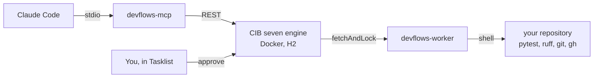

# cibseven-devflows v0.1.0 Implementation Plan

> **For agentic workers:** REQUIRED SUB-SKILL: Use superpowers:subagent-driven-development (recommended) or superpowers:executing-plans to implement this plan task-by-task. Steps use checkbox (`- [ ]`) syntax for tracking.

**Goal:** Ship a working v0.1.0 of `cibseven-devflows`, which runs a repository's release ritual as a BPMN process on a local CIB seven engine and lets AI agents start, watch and approve it over MCP.

**Architecture:** Three small Python packages in one repository. `devflows_core` holds the engine REST client, the `devflows.yaml` parser and the shell step runner. `devflows_worker` is a fetch-and-lock loop that dispatches external tasks to three pure handler functions. `devflows_mcp` is a stdio MCP server whose seven tools are thin wrappers over plain functions that take an engine client, so every tool is testable without a server.

**Tech Stack:** Python 3.12, uv, httpx, PyYAML, the official `mcp` package (`mcp.server.fastmcp.FastMCP`), pytest, ruff. CIB seven 2.2.0 in Docker with H2. BPMN 2.0 with the Camunda extension namespace.

## Global Constraints

- Python `>=3.12`. Managed with `uv`. The virtual environment stays in the repository on `C:`.
- Runtime dependencies are exactly: `httpx`, `pyyaml`, `mcp`. Dev dependencies are exactly: `pytest`, `ruff`.
- No HTTP mocking library. Engine calls are tested with `httpx.MockTransport`.
- Engine REST base URL default: `http://localhost:8080/engine-rest`. Override with env `DEVFLOWS_ENGINE_URL`.
- BPMN process definition key: `devflows-release`. External task topics: `devflows.gates`, `devflows.tag`, `devflows.publish`.
- Process variables in, exact names: `repo_path`, `version`, `dry_run`.
- Process variables out, exact names: `gates_passed`, `gates_report`, `approved`, `approval_comment`, `tag_name`, `release_url`.
- Console entry points, exact names: `devflows-worker`, `devflows-mcp`.
- License Apache-2.0. All code, comments, docs and commit messages in English.
- Local-first: no cloud services, no telemetry, no accounts beyond GitHub for publishing.
- Ruff line length 100. Ruff rules `E`, `F`, `I`, `UP`, `B`.
- Commit after every task. Ask the user before the first public push and before the real, non-dry-run release run. Nothing else needs permission.
- On this machine the Docker CLI is not on `PATH`. It lives at
  `C:\Users\Julius\AppData\Local\Programs\DockerDesktop\resources\bin\docker.exe`.
- uv cache belongs on the fast-primary devstorage drive:
  `UV_CACHE_DIR=F:\agent-devstorage\shared-cache\cibseven-devflows\cache\uv`.

## File Structure

| File | Responsibility |
| --- | --- |
| `pyproject.toml` | One project, three packages, dependencies, entry points, ruff and pytest config |
| `.gitattributes` | Normalise line endings so Git stops rewriting BPMN and YAML |
| `core/devflows_core/__init__.py` | Package marker and version |
| `core/devflows_core/config.py` | `devflows.yaml` parsing into typed objects |
| `core/devflows_core/steps.py` | Running one shell command and trimming its output |
| `core/devflows_core/variables.py` | Encoding and decoding Camunda REST variable payloads |
| `core/devflows_core/engine.py` | `EngineClient`, every REST call the project makes |
| `core/devflows_core/paths.py` | Finding `processes/release.bpmn` from an installed package |
| `workers/devflows_worker/__init__.py` | Package marker |
| `workers/devflows_worker/handlers.py` | The three topic handlers, pure functions |
| `workers/devflows_worker/main.py` | Fetch-and-lock loop and the `devflows-worker` entry point |
| `mcp/devflows_mcp/__init__.py` | Package marker |
| `mcp/devflows_mcp/tools.py` | The seven tools as plain functions taking a client |
| `mcp/devflows_mcp/server.py` | FastMCP wiring and the `devflows-mcp` entry point |
| `processes/release.bpmn` | The release ritual process |
| `engine/docker-compose.yml` | CIB seven 2.2.0 with a persistent H2 volume |
| `engine/README.md` | Engine up, down, URLs, login, Docker CLI path |
| `devflows.yaml` | This repository's own gates, tag format and publish command |
| `tests/` | Unit tests, one module per source module |
| `tests/integration/` | Live-engine tests that skip when the engine is down |
| `.github/workflows/ci.yml` | uv sync, ruff check, pytest on ubuntu-latest |
| `plugin/` | Claude Code plugin: manifest, `.mcp.json`, skill, command |
| `README.md`, `CHANGELOG.md`, `docs/DEMO.md` | Documentation |

---

### Task 1: Project scaffolding

**Files:**
- Create: `pyproject.toml`
- Create: `.gitattributes`
- Create: `core/devflows_core/__init__.py`
- Create: `workers/devflows_worker/__init__.py`
- Create: `mcp/devflows_mcp/__init__.py`
- Test: `tests/test_packaging.py`

**Interfaces:**
- Consumes: nothing.
- Produces: importable packages `devflows_core`, `devflows_worker`, `devflows_mcp`, each with a
  `__version__` string equal to `"0.1.0"`. Working commands `uv run pytest` and `uv run ruff check .`.

- [ ] **Step 1: Write the failing test**

`tests/test_packaging.py`:

```python
"""The three packages must be importable and agree on the version."""

import devflows_core
import devflows_mcp
import devflows_worker

EXPECTED_VERSION = "0.1.0"


def test_all_packages_share_one_version():
    assert devflows_core.__version__ == EXPECTED_VERSION
    assert devflows_worker.__version__ == EXPECTED_VERSION
    assert devflows_mcp.__version__ == EXPECTED_VERSION
```

- [ ] **Step 2: Run test to verify it fails**

```bash
uv run pytest tests/test_packaging.py -v
```

Expected: FAIL with `ModuleNotFoundError: No module named 'devflows_core'`.

- [ ] **Step 3: Write minimal implementation**

`pyproject.toml`:

```toml
[project]
name = "cibseven-devflows"
version = "0.1.0"
description = "Run developer workflows as BPMN processes on a local CIB seven engine"
readme = "README.md"
requires-python = ">=3.12"
license = { text = "Apache-2.0" }
authors = [{ name = "Julius" }]
dependencies = [
    "httpx>=0.27",
    "pyyaml>=6.0",
    "mcp>=1.2",
]

[project.scripts]
devflows-worker = "devflows_worker.main:main"
devflows-mcp = "devflows_mcp.server:main"

[dependency-groups]
dev = [
    "pytest>=8.0",
    "ruff>=0.6",
]

[build-system]
requires = ["hatchling"]
build-backend = "hatchling.build"

[tool.hatch.build.targets.wheel]
packages = [
    "core/devflows_core",
    "workers/devflows_worker",
    "mcp/devflows_mcp",
]

[tool.ruff]
line-length = 100
target-version = "py312"

[tool.ruff.lint]
select = ["E", "F", "I", "UP", "B"]

[tool.pytest.ini_options]
testpaths = ["tests"]
addopts = "-q"
```

`.gitattributes`:

```
* text=auto eol=lf
*.bpmn text eol=lf
*.png binary
```

`core/devflows_core/__init__.py`:

```python
"""Shared building blocks for cibseven-devflows: config, steps, engine client."""

__version__ = "0.1.0"
```

`workers/devflows_worker/__init__.py`:

```python
"""External task worker for the cibseven-devflows release process."""

__version__ = "0.1.0"
```

`mcp/devflows_mcp/__init__.py`:

```python
"""MCP server that lets an AI agent drive cibseven-devflows processes."""

__version__ = "0.1.0"
```

- [ ] **Step 4: Run the tests and the linter**

```bash
uv sync
```

```bash
uv run pytest tests/test_packaging.py -v
```

Expected: PASS.

```bash
uv run ruff check .
```

Expected: `All checks passed!`

- [ ] **Step 5: Commit**

```bash
git add pyproject.toml .gitattributes uv.lock core workers mcp tests
git commit -m "build: scaffold the three devflows packages with uv, ruff and pytest"
```

---

### Task 2: Config parsing

**Files:**
- Create: `core/devflows_core/config.py`
- Test: `tests/test_config.py`

**Interfaces:**
- Consumes: nothing.
- Produces:
  - `class ConfigError(Exception)`
  - `@dataclass(frozen=True) class Gate: name: str; run: str`
  - `@dataclass(frozen=True) class TagConfig: format: str`
  - `@dataclass(frozen=True) class PublishConfig: run: str`
  - `@dataclass(frozen=True) class DevflowsConfig: gates: tuple[Gate, ...]; tag: TagConfig; publish: PublishConfig`
  - `CONFIG_FILENAME: str = "devflows.yaml"`
  - `def parse_config(text: str, source: str = "<string>") -> DevflowsConfig`
  - `def load_config(repo_path: str | Path) -> DevflowsConfig`

- [ ] **Step 1: Write the failing test**

`tests/test_config.py`:

```python
"""Parsing devflows.yaml into typed configuration objects."""

import pytest

from devflows_core.config import (
    ConfigError,
    DevflowsConfig,
    Gate,
    load_config,
    parse_config,
)

VALID = """
gates:
  - name: tests
    run: uv run pytest -q
  - name: lint
    run: uv run ruff check .

tag:
  format: "v{version}"

publish:
  run: gh release create v{version} --generate-notes
"""


def test_parses_a_valid_file():
    config = parse_config(VALID)
    assert isinstance(config, DevflowsConfig)
    assert config.gates == (
        Gate(name="tests", run="uv run pytest -q"),
        Gate(name="lint", run="uv run ruff check ."),
    )
    assert config.tag.format == "v{version}"
    assert config.publish.run == "gh release create v{version} --generate-notes"


def test_tag_format_defaults_to_v_prefix():
    config = parse_config("gates:\n  - name: t\n    run: true\npublish:\n  run: echo hi\n")
    assert config.tag.format == "v{version}"


def test_unknown_top_level_keys_are_ignored():
    config = parse_config(VALID + "\nfuture_step:\n  run: echo hi\n")
    assert len(config.gates) == 2


def test_empty_gate_list_is_an_error():
    with pytest.raises(ConfigError, match="at least one gate"):
        parse_config("gates: []\npublish:\n  run: echo hi\n")


def test_missing_gates_key_is_an_error():
    with pytest.raises(ConfigError, match="at least one gate"):
        parse_config("publish:\n  run: echo hi\n")


def test_gate_without_run_is_an_error():
    with pytest.raises(ConfigError, match="run"):
        parse_config("gates:\n  - name: tests\npublish:\n  run: echo hi\n")


def test_missing_publish_is_an_error():
    with pytest.raises(ConfigError, match="publish"):
        parse_config("gates:\n  - name: t\n    run: true\n")


def test_malformed_yaml_is_an_error():
    with pytest.raises(ConfigError, match="not valid YAML"):
        parse_config("gates: [unclosed\n")


def test_non_mapping_document_is_an_error():
    with pytest.raises(ConfigError, match="mapping"):
        parse_config("- just\n- a\n- list\n")


def test_error_message_names_the_source():
    with pytest.raises(ConfigError, match="my-repo/devflows.yaml"):
        parse_config("gates: []\npublish:\n  run: x\n", source="my-repo/devflows.yaml")


def test_load_config_reads_the_file_from_a_repository(tmp_path):
    (tmp_path / "devflows.yaml").write_text(VALID, encoding="utf-8")
    config = load_config(tmp_path)
    assert config.gates[0].name == "tests"


def test_load_config_reports_a_missing_file(tmp_path):
    with pytest.raises(ConfigError, match="No devflows.yaml"):
        load_config(tmp_path)


def test_load_config_reports_a_missing_repository(tmp_path):
    with pytest.raises(ConfigError, match="does not exist"):
        load_config(tmp_path / "nope")
```

- [ ] **Step 2: Run test to verify it fails**

```bash
uv run pytest tests/test_config.py -v
```

Expected: FAIL with `ModuleNotFoundError: No module named 'devflows_core.config'`.

- [ ] **Step 3: Write minimal implementation**

`core/devflows_core/config.py`:

```python
"""Read a repository's devflows.yaml into typed configuration objects.

The file describes what each step of the release process runs. Keeping the
parsing here means the worker never has to guess what a half-written config
means: either it produces a DevflowsConfig or it raises ConfigError with a
message a human can act on.
"""

from __future__ import annotations

from dataclasses import dataclass
from pathlib import Path

import yaml

CONFIG_FILENAME = "devflows.yaml"
DEFAULT_TAG_FORMAT = "v{version}"


class ConfigError(Exception):
    """The configuration file is missing, unreadable or incomplete."""


@dataclass(frozen=True)
class Gate:
    """One quality gate: a name for humans and a shell command to run."""

    name: str
    run: str


@dataclass(frozen=True)
class TagConfig:
    """How to build the tag name from the version."""

    format: str = DEFAULT_TAG_FORMAT


@dataclass(frozen=True)
class PublishConfig:
    """The shell command that publishes the release."""

    run: str


@dataclass(frozen=True)
class DevflowsConfig:
    """Everything the release process needs to know about one repository."""

    gates: tuple[Gate, ...]
    tag: TagConfig
    publish: PublishConfig


def parse_config(text: str, source: str = "<string>") -> DevflowsConfig:
    """Parse the text of a devflows.yaml file."""
    try:
        document = yaml.safe_load(text)
    except yaml.YAMLError as error:
        raise ConfigError(f"{source} is not valid YAML: {error}") from error

    if document is None or not isinstance(document, dict):
        raise ConfigError(f"{source} must contain a mapping at the top level")

    return DevflowsConfig(
        gates=_parse_gates(document.get("gates"), source),
        tag=_parse_tag(document.get("tag"), source),
        publish=_parse_publish(document.get("publish"), source),
    )


def load_config(repo_path: str | Path) -> DevflowsConfig:
    """Read devflows.yaml from a repository directory."""
    repo = Path(repo_path)
    if not repo.is_dir():
        raise ConfigError(f"Repository path does not exist: {repo}")

    config_file = repo / CONFIG_FILENAME
    if not config_file.is_file():
        raise ConfigError(f"No {CONFIG_FILENAME} in {repo}")

    return parse_config(config_file.read_text(encoding="utf-8"), source=str(config_file))


def _parse_gates(raw: object, source: str) -> tuple[Gate, ...]:
    if not isinstance(raw, list) or not raw:
        raise ConfigError(f"{source} must define at least one gate under 'gates'")

    gates = []
    for index, entry in enumerate(raw, start=1):
        if not isinstance(entry, dict):
            raise ConfigError(f"{source}: gate {index} must be a mapping")
        name = entry.get("name")
        run = entry.get("run")
        if not isinstance(name, str) or not name.strip():
            raise ConfigError(f"{source}: gate {index} needs a non-empty 'name'")
        if not isinstance(run, str) or not run.strip():
            raise ConfigError(f"{source}: gate '{name}' needs a non-empty 'run'")
        gates.append(Gate(name=name, run=run))
    return tuple(gates)


def _parse_tag(raw: object, source: str) -> TagConfig:
    if raw is None:
        return TagConfig()
    if not isinstance(raw, dict):
        raise ConfigError(f"{source}: 'tag' must be a mapping")
    tag_format = raw.get("format", DEFAULT_TAG_FORMAT)
    if not isinstance(tag_format, str) or not tag_format.strip():
        raise ConfigError(f"{source}: 'tag.format' must be a non-empty string")
    return TagConfig(format=tag_format)


def _parse_publish(raw: object, source: str) -> PublishConfig:
    if not isinstance(raw, dict):
        raise ConfigError(f"{source} must define a 'publish' mapping")
    run = raw.get("run")
    if not isinstance(run, str) or not run.strip():
        raise ConfigError(f"{source}: 'publish.run' must be a non-empty string")
    return PublishConfig(run=run)
```

- [ ] **Step 4: Run the tests**

```bash
uv run pytest tests/test_config.py -v
```

Expected: PASS, 13 tests.

```bash
uv run ruff check .
```

Expected: `All checks passed!`

- [ ] **Step 5: Commit**

```bash
git add core/devflows_core/config.py tests/test_config.py
git commit -m "feat(core): parse devflows.yaml into typed configuration"
```

---

### Task 3: Shell step runner

**Files:**
- Create: `core/devflows_core/steps.py`
- Test: `tests/test_steps.py`

**Interfaces:**
- Consumes: nothing.
- Produces:
  - `MAX_OUTPUT_CHARS: int = 4000`
  - `DEFAULT_TIMEOUT_SECONDS: int = 900`
  - `@dataclass(frozen=True) class StepResult` with fields `command: str`, `exit_code: int`,
    `output: str`, `duration_seconds: float`, `timed_out: bool`, and property `ok: bool`
  - `def trim_output(text: str, limit: int = MAX_OUTPUT_CHARS) -> str`
  - `def run_step(command: str, cwd: Path, timeout: int = DEFAULT_TIMEOUT_SECONDS) -> StepResult`

- [ ] **Step 1: Write the failing test**

`tests/test_steps.py`:

```python
"""Running one shell command and reporting what happened."""

import sys

from devflows_core.steps import (
    MAX_OUTPUT_CHARS,
    StepResult,
    run_step,
    trim_output,
)


def test_successful_command_reports_exit_code_zero(tmp_path):
    result = run_step(f'{sys.executable} -c "print(\'hello\')"', cwd=tmp_path)
    assert isinstance(result, StepResult)
    assert result.exit_code == 0
    assert result.ok is True
    assert result.timed_out is False
    assert "hello" in result.output


def test_failing_command_reports_a_non_zero_exit_code(tmp_path):
    result = run_step(f'{sys.executable} -c "import sys; sys.exit(3)"', cwd=tmp_path)
    assert result.exit_code == 3
    assert result.ok is False


def test_stderr_is_captured_too(tmp_path):
    command = f'{sys.executable} -c "import sys; sys.stderr.write(\'boom\')"'
    result = run_step(command, cwd=tmp_path)
    assert "boom" in result.output


def test_command_runs_in_the_given_directory(tmp_path):
    marker = tmp_path / "marker.txt"
    marker.write_text("found me", encoding="utf-8")
    command = f'{sys.executable} -c "print(open(\'marker.txt\').read())"'
    result = run_step(command, cwd=tmp_path)
    assert "found me" in result.output


def test_timeout_is_reported_and_not_raised(tmp_path):
    command = f'{sys.executable} -c "import time; time.sleep(5)"'
    result = run_step(command, cwd=tmp_path, timeout=1)
    assert result.timed_out is True
    assert result.ok is False
    assert "timed out" in result.output.lower()


def test_duration_is_recorded(tmp_path):
    result = run_step(f'{sys.executable} -c "pass"', cwd=tmp_path)
    assert result.duration_seconds >= 0.0


def test_output_is_trimmed_before_it_reaches_the_engine(tmp_path):
    command = f'{sys.executable} -c "print(\'x\' * 20000)"'
    result = run_step(command, cwd=tmp_path)
    assert len(result.output) <= MAX_OUTPUT_CHARS + 200


def test_trim_output_keeps_short_text_unchanged():
    assert trim_output("short") == "short"


def test_trim_output_keeps_the_head_and_the_tail():
    text = "A" * 100 + "B" * 100
    trimmed = trim_output(text, limit=60)
    assert trimmed.startswith("A")
    assert trimmed.endswith("B")
    assert "trimmed" in trimmed
```

- [ ] **Step 2: Run test to verify it fails**

```bash
uv run pytest tests/test_steps.py -v
```

Expected: FAIL with `ModuleNotFoundError: No module named 'devflows_core.steps'`.

- [ ] **Step 3: Write minimal implementation**

`core/devflows_core/steps.py`:

```python
"""Run one shell command from devflows.yaml and report the result.

The commands come from the repository being released, they run as the
developer, on the developer's machine, in that repository's directory. That is
the whole point: the engine holds the state, the machine does the work.
"""

from __future__ import annotations

import subprocess
import time
from dataclasses import dataclass
from pathlib import Path

MAX_OUTPUT_CHARS = 4000
DEFAULT_TIMEOUT_SECONDS = 900


@dataclass(frozen=True)
class StepResult:
    """What happened when one command ran."""

    command: str
    exit_code: int
    output: str
    duration_seconds: float
    timed_out: bool = False

    @property
    def ok(self) -> bool:
        """True only when the command finished and reported success."""
        return self.exit_code == 0 and not self.timed_out


def trim_output(text: str, limit: int = MAX_OUTPUT_CHARS) -> str:
    """Shorten long output, keeping the beginning and the end.

    Process variables live in the engine database. A chatty test run must not
    be allowed to fill it, but the first and last lines are usually the ones
    that explain a failure, so both ends are kept.
    """
    if len(text) <= limit:
        return text
    half = limit // 2
    removed = len(text) - 2 * half
    return f"{text[:half]}\n... [{removed} characters trimmed] ...\n{text[-half:]}"


def run_step(
    command: str,
    cwd: Path,
    timeout: int = DEFAULT_TIMEOUT_SECONDS,
) -> StepResult:
    """Run a shell command in a directory and capture everything it printed."""
    started = time.monotonic()
    try:
        completed = subprocess.run(  # noqa: S602 - commands come from the repo's own config
            command,
            shell=True,
            cwd=str(cwd),
            capture_output=True,
            text=True,
            timeout=timeout,
            check=False,
        )
    except subprocess.TimeoutExpired as expired:
        duration = time.monotonic() - started
        partial = _merge(expired.stdout, expired.stderr)
        return StepResult(
            command=command,
            exit_code=124,
            output=trim_output(f"{partial}\nCommand timed out after {timeout} seconds."),
            duration_seconds=duration,
            timed_out=True,
        )

    duration = time.monotonic() - started
    return StepResult(
        command=command,
        exit_code=completed.returncode,
        output=trim_output(_merge(completed.stdout, completed.stderr)),
        duration_seconds=duration,
    )


def _merge(stdout: str | bytes | None, stderr: str | bytes | None) -> str:
    """Join captured stdout and stderr into one readable block."""
    parts = []
    for stream in (stdout, stderr):
        if not stream:
            continue
        text = stream.decode("utf-8", "replace") if isinstance(stream, bytes) else stream
        text = text.strip()
        if text:
            parts.append(text)
    return "\n".join(parts)
```

- [ ] **Step 4: Run the tests**

```bash
uv run pytest tests/test_steps.py -v
```

Expected: PASS, 9 tests.

```bash
uv run ruff check .
```

Expected: `All checks passed!`

- [ ] **Step 5: Commit**

```bash
git add core/devflows_core/steps.py tests/test_steps.py
git commit -m "feat(core): run devflows.yaml shell steps and trim their output"
```

---

### Task 4: Camunda variable encoding

**Files:**
- Create: `core/devflows_core/variables.py`
- Test: `tests/test_variables.py`

**Interfaces:**
- Consumes: nothing.
- Produces:
  - `def to_engine(values: dict[str, object]) -> dict[str, dict[str, object]]`
  - `def from_engine(payload: dict[str, dict[str, object]]) -> dict[str, object]`

The Camunda 7 REST API wraps every variable as `{"value": ..., "type": "String"}`. Both the worker
and the MCP server need to go in and out of that shape, so it lives on its own.

- [ ] **Step 1: Write the failing test**

`tests/test_variables.py`:

```python
"""Camunda REST wraps variables in {"value": ..., "type": ...}. Go both ways."""

from devflows_core.variables import from_engine, to_engine


def test_encodes_python_types_to_camunda_types():
    encoded = to_engine({"repo_path": "C:/repo", "dry_run": True, "retries": 3, "ratio": 0.5})
    assert encoded["repo_path"] == {"value": "C:/repo", "type": "String"}
    assert encoded["dry_run"] == {"value": True, "type": "Boolean"}
    assert encoded["retries"] == {"value": 3, "type": "Long"}
    assert encoded["ratio"] == {"value": 0.5, "type": "Double"}


def test_encodes_none_as_a_null_string():
    assert to_engine({"comment": None}) == {"comment": {"value": None, "type": "String"}}


def test_booleans_are_not_mistaken_for_integers():
    # bool is a subclass of int in Python; the order of the checks matters.
    assert to_engine({"flag": False})["flag"]["type"] == "Boolean"


def test_unknown_types_become_strings():
    encoded = to_engine({"path": ["a", "b"]})
    assert encoded["path"]["type"] == "String"
    assert encoded["path"]["value"] == "['a', 'b']"


def test_decodes_a_camunda_payload():
    payload = {
        "gates_passed": {"value": True, "type": "Boolean"},
        "tag_name": {"value": "v0.1.0", "type": "String"},
    }
    assert from_engine(payload) == {"gates_passed": True, "tag_name": "v0.1.0"}


def test_decoding_an_empty_payload_gives_an_empty_dict():
    assert from_engine({}) == {}


def test_decoding_tolerates_entries_that_are_not_wrapped():
    assert from_engine({"raw": "plain"}) == {"raw": "plain"}
```

- [ ] **Step 2: Run test to verify it fails**

```bash
uv run pytest tests/test_variables.py -v
```

Expected: FAIL with `ModuleNotFoundError: No module named 'devflows_core.variables'`.

- [ ] **Step 3: Write minimal implementation**

`core/devflows_core/variables.py`:

```python
"""Translate between plain Python values and Camunda REST variable payloads."""

from __future__ import annotations


def to_engine(values: dict[str, object]) -> dict[str, dict[str, object]]:
    """Wrap plain values in the {"value": ..., "type": ...} shape the engine wants."""
    return {name: {"value": _value(value), "type": _type(value)} for name, value in values.items()}


def from_engine(payload: dict[str, object]) -> dict[str, object]:
    """Unwrap an engine variable payload back into plain Python values."""
    result: dict[str, object] = {}
    for name, entry in payload.items():
        if isinstance(entry, dict) and "value" in entry:
            result[name] = entry["value"]
        else:
            result[name] = entry
    return result


def _type(value: object) -> str:
    # bool must be checked before int: in Python, bool is a subclass of int.
    if value is None or isinstance(value, str):
        return "String"
    if isinstance(value, bool):
        return "Boolean"
    if isinstance(value, int):
        return "Long"
    if isinstance(value, float):
        return "Double"
    return "String"


def _value(value: object) -> object:
    if value is None or isinstance(value, str | bool | int | float):
        return value
    return str(value)
```

- [ ] **Step 4: Run the tests**

```bash
uv run pytest tests/test_variables.py -v
```

Expected: PASS, 7 tests.

- [ ] **Step 5: Commit**

```bash
git add core/devflows_core/variables.py tests/test_variables.py
git commit -m "feat(core): encode and decode Camunda REST variable payloads"
```

---

### Task 5: Engine REST client

**Files:**
- Create: `core/devflows_core/engine.py`
- Test: `tests/test_engine.py`

**Interfaces:**
- Consumes: `devflows_core.variables.to_engine`, `devflows_core.variables.from_engine`.
- Produces:
  - `DEFAULT_ENGINE_URL: str = "http://localhost:8080/engine-rest"`
  - `PROCESS_KEY: str = "devflows-release"`
  - `class EngineError(RuntimeError)`
  - `class EngineClient` with `__init__(self, base_url: str | None = None, *, transport=None, timeout: float = 30.0)`,
    context-manager support, `close()`, and these methods:
    - `engine_status() -> dict` → `{"reachable": bool, "version": str | None, "engines": list[str], "url": str, "error": str | None}`
    - `deploy(bpmn_path: Path) -> dict` → `{"deployment_id": str, "process_definition_keys": list[str]}`
    - `list_process_definitions() -> list[dict]` → each `{"key", "id", "version", "name"}`
    - `start_process(key: str, variables: dict) -> str` → the process instance id
    - `get_process_instance(pid: str) -> dict | None`
    - `get_historic_process_instance(pid: str) -> dict | None`
    - `get_variables(pid: str) -> dict`
    - `get_historic_variables(pid: str) -> dict`
    - `get_active_activity_names(pid: str) -> list[str]`
    - `list_tasks(process_instance_id: str | None = None) -> list[dict]` → each `{"id", "name", "assignee", "process_instance_id", "created"}`
    - `complete_task(task_id: str, variables: dict) -> None`
    - `fetch_and_lock(worker_id: str, topics: list[dict], max_tasks: int, async_response_timeout_ms: int) -> list[dict]`
    - `complete_external_task(task_id: str, worker_id: str, variables: dict) -> None`
    - `fail_external_task(task_id: str, worker_id: str, error_message: str, error_details: str = "", retries: int = 0, retry_timeout_ms: int = 0) -> None`

- [ ] **Step 1: Write the failing test**

`tests/test_engine.py`:

```python
"""The engine client, exercised with httpx.MockTransport - no engine needed."""

import json

import httpx
import pytest

from devflows_core.engine import DEFAULT_ENGINE_URL, EngineClient, EngineError


def client_for(handler) -> EngineClient:
    return EngineClient(transport=httpx.MockTransport(handler))


def test_default_url_matches_the_cib_seven_distribution():
    assert DEFAULT_ENGINE_URL == "http://localhost:8080/engine-rest"


def test_engine_status_reports_version_and_engines():
    def handler(request: httpx.Request) -> httpx.Response:
        if request.url.path.endswith("/version"):
            return httpx.Response(200, json={"version": "2.2.0"})
        return httpx.Response(200, json=[{"name": "default"}])

    status = client_for(handler).engine_status()
    assert status["reachable"] is True
    assert status["version"] == "2.2.0"
    assert status["engines"] == ["default"]
    assert status["error"] is None


def test_engine_status_reports_an_unreachable_engine():
    def handler(request: httpx.Request) -> httpx.Response:
        raise httpx.ConnectError("connection refused", request=request)

    status = client_for(handler).engine_status()
    assert status["reachable"] is False
    assert status["version"] is None
    assert "connection refused" in status["error"]


def test_deploy_posts_multipart_and_returns_the_deployed_keys(tmp_path):
    bpmn = tmp_path / "release.bpmn"
    bpmn.write_text("<definitions/>", encoding="utf-8")
    seen = {}

    def handler(request: httpx.Request) -> httpx.Response:
        seen["path"] = request.url.path
        seen["body"] = request.content
        return httpx.Response(
            200,
            json={
                "id": "dep-1",
                "deployedProcessDefinitions": {
                    "devflows-release:1:abc": {"key": "devflows-release", "version": 1}
                },
            },
        )

    result = client_for(handler).deploy(bpmn)
    assert seen["path"].endswith("/deployment/create")
    assert b"release.bpmn" in seen["body"]
    assert result == {"deployment_id": "dep-1", "process_definition_keys": ["devflows-release"]}


def test_deploy_handles_a_deployment_that_changed_nothing(tmp_path):
    bpmn = tmp_path / "release.bpmn"
    bpmn.write_text("<definitions/>", encoding="utf-8")

    def handler(request: httpx.Request) -> httpx.Response:
        return httpx.Response(200, json={"id": "dep-2", "deployedProcessDefinitions": None})

    result = client_for(handler).deploy(bpmn)
    assert result == {"deployment_id": "dep-2", "process_definition_keys": []}


def test_deploy_rejects_a_missing_file(tmp_path):
    with pytest.raises(EngineError, match="does not exist"):
        client_for(lambda r: httpx.Response(200, json={})).deploy(tmp_path / "missing.bpmn")


def test_list_process_definitions_returns_a_small_summary():
    payload = [
        {"key": "devflows-release", "id": "devflows-release:1:a", "version": 1, "name": "Release"}
    ]

    definitions = client_for(lambda r: httpx.Response(200, json=payload)).list_process_definitions()
    assert definitions == [
        {"key": "devflows-release", "id": "devflows-release:1:a", "version": 1, "name": "Release"}
    ]


def test_start_process_sends_encoded_variables_and_returns_the_instance_id():
    seen = {}

    def handler(request: httpx.Request) -> httpx.Response:
        seen["path"] = request.url.path
        seen["body"] = json.loads(request.content)
        return httpx.Response(200, json={"id": "pi-1", "definitionId": "devflows-release:1:a"})

    instance_id = client_for(handler).start_process(
        "devflows-release", {"repo_path": "C:/repo", "dry_run": True}
    )
    assert instance_id == "pi-1"
    assert seen["path"].endswith("/process-definition/key/devflows-release/start")
    assert seen["body"]["variables"]["dry_run"] == {"value": True, "type": "Boolean"}


def test_get_process_instance_returns_none_when_it_has_finished():
    client = client_for(lambda r: httpx.Response(404, json={"message": "not found"}))
    assert client.get_process_instance("pi-1") is None


def test_get_variables_decodes_the_payload():
    payload = {"gates_passed": {"value": True, "type": "Boolean"}}
    client = client_for(lambda r: httpx.Response(200, json=payload))
    assert client.get_variables("pi-1") == {"gates_passed": True}


def test_get_historic_variables_decodes_the_list_shape():
    payload = [
        {"name": "tag_name", "value": "v0.1.0", "type": "String"},
        {"name": "gates_passed", "value": True, "type": "Boolean"},
    ]
    client = client_for(lambda r: httpx.Response(200, json=payload))
    assert client.get_historic_variables("pi-1") == {"tag_name": "v0.1.0", "gates_passed": True}


def test_active_activity_names_come_from_the_activity_instance_tree():
    tree = {
        "id": "pi-1",
        "activityId": "devflows-release",
        "childActivityInstances": [
            {
                "id": "approve:1",
                "activityId": "approve_release",
                "activityName": "Approve release",
                "childActivityInstances": [],
                "childTransitionInstances": [],
            }
        ],
        "childTransitionInstances": [],
    }
    client = client_for(lambda r: httpx.Response(200, json=tree))
    assert client.get_active_activity_names("pi-1") == ["Approve release"]


def test_list_tasks_returns_a_small_summary():
    payload = [
        {
            "id": "task-1",
            "name": "Approve release",
            "assignee": None,
            "processInstanceId": "pi-1",
            "created": "2026-08-22T10:00:00.000+0000",
        }
    ]
    tasks = client_for(lambda r: httpx.Response(200, json=payload)).list_tasks("pi-1")
    assert tasks == [
        {
            "id": "task-1",
            "name": "Approve release",
            "assignee": None,
            "process_instance_id": "pi-1",
            "created": "2026-08-22T10:00:00.000+0000",
        }
    ]


def test_complete_task_sends_encoded_variables():
    seen = {}

    def handler(request: httpx.Request) -> httpx.Response:
        seen["path"] = request.url.path
        seen["body"] = json.loads(request.content)
        return httpx.Response(204)

    client_for(handler).complete_task("task-1", {"approved": True, "approval_comment": "ship it"})
    assert seen["path"].endswith("/task/task-1/complete")
    assert seen["body"]["variables"]["approved"] == {"value": True, "type": "Boolean"}


def test_fetch_and_lock_posts_the_topic_list():
    seen = {}

    def handler(request: httpx.Request) -> httpx.Response:
        seen["body"] = json.loads(request.content)
        return httpx.Response(200, json=[{"id": "et-1", "topicName": "devflows.gates"}])

    topics = [{"topicName": "devflows.gates", "lockDuration": 60000}]
    tasks = client_for(handler).fetch_and_lock("worker-1", topics, 5, 10000)
    assert tasks[0]["id"] == "et-1"
    assert seen["body"]["workerId"] == "worker-1"
    assert seen["body"]["maxTasks"] == 5
    assert seen["body"]["asyncResponseTimeout"] == 10000
    assert seen["body"]["topics"] == topics


def test_complete_external_task_sends_worker_id_and_variables():
    seen = {}

    def handler(request: httpx.Request) -> httpx.Response:
        seen["path"] = request.url.path
        seen["body"] = json.loads(request.content)
        return httpx.Response(204)

    client_for(handler).complete_external_task("et-1", "worker-1", {"gates_passed": True})
    assert seen["path"].endswith("/external-task/et-1/complete")
    assert seen["body"]["workerId"] == "worker-1"
    assert seen["body"]["variables"]["gates_passed"]["value"] is True


def test_fail_external_task_sends_the_message_and_details():
    seen = {}

    def handler(request: httpx.Request) -> httpx.Response:
        seen["path"] = request.url.path
        seen["body"] = json.loads(request.content)
        return httpx.Response(204)

    client_for(handler).fail_external_task("et-1", "worker-1", "gate failed", "pytest output")
    assert seen["path"].endswith("/external-task/et-1/failure")
    assert seen["body"]["errorMessage"] == "gate failed"
    assert seen["body"]["errorDetails"] == "pytest output"
    assert seen["body"]["retries"] == 0


def test_a_server_error_is_reported_with_the_engine_message():
    def handler(request: httpx.Request) -> httpx.Response:
        return httpx.Response(500, json={"message": "ENGINE-09999 something broke"})

    with pytest.raises(EngineError, match="ENGINE-09999"):
        client_for(handler).list_process_definitions()


def test_the_client_works_as_a_context_manager():
    with client_for(lambda r: httpx.Response(200, json=[])) as client:
        assert client.list_process_definitions() == []
```

- [ ] **Step 2: Run test to verify it fails**

```bash
uv run pytest tests/test_engine.py -v
```

Expected: FAIL with `ModuleNotFoundError: No module named 'devflows_core.engine'`.

- [ ] **Step 3: Write minimal implementation**

`core/devflows_core/engine.py`:

```python
"""A small REST client for the CIB seven / Camunda 7 engine.

Only the calls this project actually makes are implemented. Every response is
reduced to plain Python before it leaves this module, so neither the worker nor
the MCP server has to know what the engine's JSON looks like.
"""

from __future__ import annotations

import os
from pathlib import Path
from typing import Any

import httpx

from devflows_core.variables import from_engine, to_engine

DEFAULT_ENGINE_URL = "http://localhost:8080/engine-rest"
PROCESS_KEY = "devflows-release"


class EngineError(RuntimeError):
    """The engine refused a request or could not be reached."""


class EngineClient:
    """Talks to one engine over HTTP."""

    def __init__(
        self,
        base_url: str | None = None,
        *,
        transport: httpx.BaseTransport | None = None,
        timeout: float = 30.0,
    ) -> None:
        self.base_url = (base_url or os.environ.get("DEVFLOWS_ENGINE_URL") or DEFAULT_ENGINE_URL).rstrip("/")
        self._http = httpx.Client(base_url=self.base_url, transport=transport, timeout=timeout)

    def __enter__(self) -> EngineClient:
        return self

    def __exit__(self, *exc_info: object) -> None:
        self.close()

    def close(self) -> None:
        self._http.close()

    # ---- status ---------------------------------------------------------

    def engine_status(self) -> dict[str, Any]:
        """Check that the engine answers, and report its version."""
        try:
            version = self._request("GET", "/version")
            engines = self._request("GET", "/engine")
        except EngineError as error:
            return {
                "reachable": False,
                "version": None,
                "engines": [],
                "url": self.base_url,
                "error": str(error),
            }
        return {
            "reachable": True,
            "version": version.get("version"),
            "engines": [engine.get("name") for engine in engines],
            "url": self.base_url,
            "error": None,
        }

    # ---- deployment and definitions -------------------------------------

    def deploy(self, bpmn_path: Path) -> dict[str, Any]:
        """Deploy one BPMN file and report what was deployed."""
        path = Path(bpmn_path)
        if not path.is_file():
            raise EngineError(f"BPMN file does not exist: {path}")

        files = {path.name: (path.name, path.read_bytes(), "application/octet-stream")}
        data = {
            "deployment-name": "cibseven-devflows",
            "deploy-changed-only": "true",
            "deployment-source": "cibseven-devflows",
        }
        payload = self._request("POST", "/deployment/create", data=data, files=files)
        deployed = payload.get("deployedProcessDefinitions") or {}
        return {
            "deployment_id": payload.get("id"),
            "process_definition_keys": [
                definition.get("key") for definition in deployed.values()
            ],
        }

    def list_process_definitions(self) -> list[dict[str, Any]]:
        """List deployed process definitions, newest version last."""
        payload = self._request("GET", "/process-definition", params={"latestVersion": "false"})
        return [
            {
                "key": item.get("key"),
                "id": item.get("id"),
                "version": item.get("version"),
                "name": item.get("name"),
            }
            for item in payload
        ]

    # ---- instances -------------------------------------------------------

    def start_process(self, key: str, variables: dict[str, Any]) -> str:
        """Start a process instance by definition key and return its id."""
        payload = self._request(
            "POST",
            f"/process-definition/key/{key}/start",
            json={"variables": to_engine(variables)},
        )
        return payload["id"]

    def get_process_instance(self, process_instance_id: str) -> dict[str, Any] | None:
        """The running instance, or None once it has finished."""
        return self._optional("GET", f"/process-instance/{process_instance_id}")

    def get_historic_process_instance(self, process_instance_id: str) -> dict[str, Any] | None:
        """The historic record of an instance, running or finished."""
        return self._optional("GET", f"/history/process-instance/{process_instance_id}")

    def get_variables(self, process_instance_id: str) -> dict[str, Any]:
        """Variables of a running instance."""
        payload = self._request(
            "GET", f"/process-instance/{process_instance_id}/variables", params={"deserializeValues": "false"}
        )
        return from_engine(payload)

    def get_historic_variables(self, process_instance_id: str) -> dict[str, Any]:
        """Variables of a finished instance, read from history."""
        payload = self._request(
            "GET",
            "/history/variable-instance",
            params={"processInstanceId": process_instance_id, "deserializeValues": "false"},
        )
        return {item["name"]: item.get("value") for item in payload}

    def get_active_activity_names(self, process_instance_id: str) -> list[str]:
        """Names of the activities the instance is currently waiting in."""
        tree = self._optional("GET", f"/process-instance/{process_instance_id}/activity-instances")
        if tree is None:
            return []
        names: list[str] = []
        _collect_activity_names(tree, names)
        return names

    # ---- user tasks ------------------------------------------------------

    def list_tasks(self, process_instance_id: str | None = None) -> list[dict[str, Any]]:
        """Open user tasks, optionally limited to one process instance."""
        params = {"processInstanceId": process_instance_id} if process_instance_id else {}
        payload = self._request("GET", "/task", params=params)
        return [
            {
                "id": task.get("id"),
                "name": task.get("name"),
                "assignee": task.get("assignee"),
                "process_instance_id": task.get("processInstanceId"),
                "created": task.get("created"),
            }
            for task in payload
        ]

    def complete_task(self, task_id: str, variables: dict[str, Any]) -> None:
        """Complete a user task with the given variables."""
        self._request("POST", f"/task/{task_id}/complete", json={"variables": to_engine(variables)})

    # ---- external tasks --------------------------------------------------

    def fetch_and_lock(
        self,
        worker_id: str,
        topics: list[dict[str, Any]],
        max_tasks: int,
        async_response_timeout_ms: int,
    ) -> list[dict[str, Any]]:
        """Long-poll the engine for work on the given topics."""
        return self._request(
            "POST",
            "/external-task/fetchAndLock",
            json={
                "workerId": worker_id,
                "maxTasks": max_tasks,
                "usePriority": False,
                "asyncResponseTimeout": async_response_timeout_ms,
                "topics": topics,
            },
        )

    def complete_external_task(
        self, task_id: str, worker_id: str, variables: dict[str, Any]
    ) -> None:
        """Report an external task as done, with its result variables."""
        self._request(
            "POST",
            f"/external-task/{task_id}/complete",
            json={"workerId": worker_id, "variables": to_engine(variables)},
        )

    def fail_external_task(
        self,
        task_id: str,
        worker_id: str,
        error_message: str,
        error_details: str = "",
        retries: int = 0,
        retry_timeout_ms: int = 0,
    ) -> None:
        """Report an external task as failed. Zero retries creates an incident."""
        self._request(
            "POST",
            f"/external-task/{task_id}/failure",
            json={
                "workerId": worker_id,
                "errorMessage": error_message[:600],
                "errorDetails": error_details,
                "retries": retries,
                "retryTimeout": retry_timeout_ms,
            },
        )

    # ---- plumbing --------------------------------------------------------

    def _request(self, method: str, path: str, **kwargs: Any) -> Any:
        try:
            response = self._http.request(method, path, **kwargs)
        except httpx.HTTPError as error:
            raise EngineError(f"Could not reach the engine at {self.base_url}: {error}") from error

        if response.status_code >= 400:
            raise EngineError(f"{method} {path} failed ({response.status_code}): {_message(response)}")

        if response.status_code == 204 or not response.content:
            return None
        return response.json()

    def _optional(self, method: str, path: str, **kwargs: Any) -> Any | None:
        try:
            return self._request(method, path, **kwargs)
        except EngineError as error:
            if "(404)" in str(error):
                return None
            raise


def _message(response: httpx.Response) -> str:
    try:
        payload = response.json()
    except ValueError:
        return response.text[:400]
    if isinstance(payload, dict):
        return str(payload.get("message") or payload)[:400]
    return str(payload)[:400]


def _collect_activity_names(node: dict[str, Any], names: list[str]) -> None:
    children = node.get("childActivityInstances") or []
    for child in children:
        _collect_activity_names(child, names)
    if not children and node.get("activityName"):
        names.append(node["activityName"])
```

- [ ] **Step 4: Run the tests**

```bash
uv run pytest tests/test_engine.py -v
```

Expected: PASS, 18 tests.

```bash
uv run ruff check .
```

Expected: `All checks passed!`

- [ ] **Step 5: Commit**

```bash
git add core/devflows_core/engine.py tests/test_engine.py
git commit -m "feat(core): add the CIB seven REST client"
```

---

### Task 6: Topic handlers

**Files:**
- Create: `workers/devflows_worker/handlers.py`
- Test: `tests/test_handlers.py`

**Interfaces:**
- Consumes: `devflows_core.config.load_config`, `devflows_core.config.ConfigError`,
  `devflows_core.steps.run_step`, `devflows_core.steps.StepResult`.
- Produces:
  - `GATES_TOPIC = "devflows.gates"`, `TAG_TOPIC = "devflows.tag"`, `PUBLISH_TOPIC = "devflows.publish"`
  - `class HandlerError(Exception)` with attributes `message: str` and `details: str`
  - `def handle_gates(variables: dict, *, runner=run_step) -> dict`
  - `def handle_tag(variables: dict, *, runner=run_step) -> dict`
  - `def handle_publish(variables: dict, *, runner=run_step) -> dict`
  - `HANDLERS: dict[str, Callable[..., dict]]` mapping each topic to its handler

  Every handler takes decoded plain variables and returns plain result variables. `runner` is
  injected so tests never start a real process.

- [ ] **Step 1: Write the failing test**

`tests/test_handlers.py`:

```python
"""The three external task handlers, with the shell runner replaced by a fake."""

import json

import pytest

from devflows_core.steps import StepResult
from devflows_worker.handlers import (
    GATES_TOPIC,
    HANDLERS,
    PUBLISH_TOPIC,
    TAG_TOPIC,
    HandlerError,
    handle_gates,
    handle_publish,
    handle_tag,
)

CONFIG = """
gates:
  - name: tests
    run: pytest -q
  - name: lint
    run: ruff check .

tag:
  format: "v{version}"

publish:
  run: gh release create v{version} --generate-notes
"""


@pytest.fixture()
def repo(tmp_path):
    (tmp_path / "devflows.yaml").write_text(CONFIG, encoding="utf-8")
    return tmp_path


def fake_runner(results):
    """Return a runner that replays canned results and records the commands."""
    calls = []

    def runner(command, cwd, timeout=900):
        calls.append(command)
        outcome = results.pop(0) if results else 0
        if isinstance(outcome, StepResult):
            return outcome
        return StepResult(command=command, exit_code=outcome, output="ok", duration_seconds=0.1)

    runner.calls = calls
    return runner


def test_every_topic_has_a_handler():
    assert set(HANDLERS) == {GATES_TOPIC, TAG_TOPIC, PUBLISH_TOPIC}


# ---- gates ---------------------------------------------------------------


def test_gates_pass_when_every_command_exits_zero(repo):
    runner = fake_runner([0, 0])
    result = handle_gates({"repo_path": str(repo), "dry_run": False}, runner=runner)
    assert result["gates_passed"] is True
    report = json.loads(result["gates_report"])
    assert [entry["name"] for entry in report] == ["tests", "lint"]
    assert all(entry["passed"] for entry in report)
    assert runner.calls == ["pytest -q", "ruff check ."]


def test_gates_fail_when_one_command_fails(repo):
    runner = fake_runner([1, 0])
    result = handle_gates({"repo_path": str(repo), "dry_run": False}, runner=runner)
    assert result["gates_passed"] is False
    report = json.loads(result["gates_report"])
    assert report[0]["passed"] is False
    assert report[0]["exit_code"] == 1


def test_gates_stop_at_the_first_failure(repo):
    runner = fake_runner([1, 0])
    handle_gates({"repo_path": str(repo), "dry_run": False}, runner=runner)
    assert runner.calls == ["pytest -q"]


def test_gates_run_for_real_even_in_a_dry_run(repo):
    runner = fake_runner([0, 0])
    result = handle_gates({"repo_path": str(repo), "dry_run": True}, runner=runner)
    assert runner.calls == ["pytest -q", "ruff check ."]
    assert result["gates_passed"] is True


def test_gates_report_a_missing_config_as_a_handler_error(tmp_path):
    with pytest.raises(HandlerError, match="No devflows.yaml"):
        handle_gates({"repo_path": str(tmp_path), "dry_run": False}, runner=fake_runner([]))


def test_gates_require_repo_path():
    with pytest.raises(HandlerError, match="repo_path"):
        handle_gates({"dry_run": False}, runner=fake_runner([]))


# ---- tag -----------------------------------------------------------------


def test_tag_builds_the_name_from_the_configured_format(repo):
    runner = fake_runner([0])
    result = handle_tag(
        {"repo_path": str(repo), "version": "0.1.0", "dry_run": False}, runner=runner
    )
    assert result["tag_name"] == "v0.1.0"
    assert result["tag_created"] is True
    assert runner.calls == ['git tag -a v0.1.0 -m "Release v0.1.0"']


def test_tag_creates_nothing_in_a_dry_run(repo):
    runner = fake_runner([])
    result = handle_tag(
        {"repo_path": str(repo), "version": "0.1.0", "dry_run": True}, runner=runner
    )
    assert result["tag_name"] == "v0.1.0"
    assert result["tag_created"] is False
    assert runner.calls == []


def test_tag_requires_a_version(repo):
    with pytest.raises(HandlerError, match="version"):
        handle_tag({"repo_path": str(repo), "dry_run": False}, runner=fake_runner([]))


def test_tag_reports_a_failing_git_command(repo):
    failed = StepResult(
        command="git tag", exit_code=128, output="fatal: tag already exists", duration_seconds=0.1
    )
    with pytest.raises(HandlerError, match="already exists"):
        handle_tag(
            {"repo_path": str(repo), "version": "0.1.0", "dry_run": False},
            runner=fake_runner([failed]),
        )


# ---- publish -------------------------------------------------------------


def test_publish_checks_gh_pushes_the_tag_and_creates_the_release(repo):
    created = StepResult(
        command="gh release create",
        exit_code=0,
        output="https://github.com/0langa/cibseven-devflows/releases/tag/v0.1.0",
        duration_seconds=0.2,
    )
    runner = fake_runner([0, 0, created])
    result = handle_publish(
        {"repo_path": str(repo), "version": "0.1.0", "tag_name": "v0.1.0", "dry_run": False},
        runner=runner,
    )
    assert runner.calls == [
        "gh auth status",
        "git push origin v0.1.0",
        "gh release create v0.1.0 --generate-notes",
    ]
    assert result["published"] is True
    assert result["release_url"] == (
        "https://github.com/0langa/cibseven-devflows/releases/tag/v0.1.0"
    )


def test_publish_does_nothing_in_a_dry_run(repo):
    runner = fake_runner([])
    result = handle_publish(
        {"repo_path": str(repo), "version": "0.1.0", "tag_name": "v0.1.0", "dry_run": True},
        runner=runner,
    )
    assert runner.calls == []
    assert result["published"] is False
    assert "dry run" in result["release_url"].lower()
    assert "gh release create v0.1.0 --generate-notes" in result["publish_command"]


def test_publish_fails_clearly_when_gh_is_not_authenticated(repo):
    not_logged_in = StepResult(
        command="gh auth status",
        exit_code=1,
        output="You are not logged into any GitHub hosts.",
        duration_seconds=0.1,
    )
    with pytest.raises(HandlerError, match="gh"):
        handle_publish(
            {"repo_path": str(repo), "version": "0.1.0", "tag_name": "v0.1.0", "dry_run": False},
            runner=fake_runner([not_logged_in]),
        )


def test_publish_falls_back_to_the_tag_name_from_the_config(repo):
    created = StepResult(
        command="gh", exit_code=0, output="no url here", duration_seconds=0.1
    )
    runner = fake_runner([0, 0, created])
    result = handle_publish(
        {"repo_path": str(repo), "version": "0.1.0", "dry_run": False}, runner=runner
    )
    assert "git push origin v0.1.0" in runner.calls
    assert result["release_url"] == ""
```

- [ ] **Step 2: Run test to verify it fails**

```bash
uv run pytest tests/test_handlers.py -v
```

Expected: FAIL with `ModuleNotFoundError: No module named 'devflows_worker.handlers'`.

- [ ] **Step 3: Write minimal implementation**

`workers/devflows_worker/handlers.py`:

```python
"""What each external task topic actually does.

Handlers are plain functions: decoded process variables in, result variables
out. They know nothing about HTTP, which is what makes them easy to test. The
shell runner is injected so a test can replay canned results instead of
starting real processes.
"""

from __future__ import annotations

import json
import re
from collections.abc import Callable
from pathlib import Path
from typing import Any

from devflows_core.config import ConfigError, DevflowsConfig, load_config
from devflows_core.steps import StepResult, run_step

GATES_TOPIC = "devflows.gates"
TAG_TOPIC = "devflows.tag"
PUBLISH_TOPIC = "devflows.publish"

_URL_PATTERN = re.compile(r"https://\S+")


class HandlerError(Exception):
    """A handler could not do its job. The message goes back to the engine."""

    def __init__(self, message: str, details: str = "") -> None:
        super().__init__(message)
        self.message = message
        self.details = details


def handle_gates(variables: dict[str, Any], *, runner: Callable[..., StepResult] = run_step) -> dict[str, Any]:
    """Run every gate in order and stop at the first failure."""
    repo, config = _repo_and_config(variables)

    report: list[dict[str, Any]] = []
    passed = True
    for gate in config.gates:
        result = runner(gate.run, cwd=repo)
        report.append(
            {
                "name": gate.name,
                "command": gate.run,
                "exit_code": result.exit_code,
                "passed": result.ok,
                "duration_seconds": round(result.duration_seconds, 2),
                "timed_out": result.timed_out,
                "output": result.output,
            }
        )
        if not result.ok:
            passed = False
            break

    return {
        "gates_passed": passed,
        "gates_report": json.dumps(report, indent=2),
    }


def handle_tag(variables: dict[str, Any], *, runner: Callable[..., StepResult] = run_step) -> dict[str, Any]:
    """Create the release tag, or report the tag a real run would create."""
    repo, config = _repo_and_config(variables)
    version = _required(variables, "version")
    dry_run = bool(variables.get("dry_run", False))

    tag_name = config.tag.format.format(version=version)
    if dry_run:
        return {"tag_name": tag_name, "tag_created": False, "dry_run": True}

    command = f'git tag -a {tag_name} -m "Release {tag_name}"'
    result = runner(command, cwd=repo)
    if not result.ok:
        raise HandlerError(f"Could not create tag {tag_name}: {result.output}", result.output)

    return {"tag_name": tag_name, "tag_created": True, "dry_run": False}


def handle_publish(variables: dict[str, Any], *, runner: Callable[..., StepResult] = run_step) -> dict[str, Any]:
    """Push the tag and create the GitHub Release."""
    repo, config = _repo_and_config(variables)
    version = _required(variables, "version")
    dry_run = bool(variables.get("dry_run", False))
    tag_name = variables.get("tag_name") or config.tag.format.format(version=version)
    publish_command = config.publish.run.format(version=version)

    if dry_run:
        return {
            "release_url": f"(dry run) would publish {tag_name}",
            "published": False,
            "publish_command": publish_command,
            "dry_run": True,
        }

    auth = runner("gh auth status", cwd=repo)
    if not auth.ok:
        raise HandlerError(
            "gh is not authenticated. Run 'gh auth login' and start the release again.",
            auth.output,
        )

    push = runner(f"git push origin {tag_name}", cwd=repo)
    if not push.ok:
        raise HandlerError(f"Could not push tag {tag_name}: {push.output}", push.output)

    release = runner(publish_command, cwd=repo)
    if not release.ok:
        raise HandlerError(f"Publishing failed: {release.output}", release.output)

    match = _URL_PATTERN.search(release.output)
    return {
        "release_url": match.group(0) if match else "",
        "published": True,
        "publish_command": publish_command,
        "dry_run": False,
    }


HANDLERS: dict[str, Callable[..., dict[str, Any]]] = {
    GATES_TOPIC: handle_gates,
    TAG_TOPIC: handle_tag,
    PUBLISH_TOPIC: handle_publish,
}


def _repo_and_config(variables: dict[str, Any]) -> tuple[Path, DevflowsConfig]:
    repo = Path(_required(variables, "repo_path"))
    try:
        return repo, load_config(repo)
    except ConfigError as error:
        raise HandlerError(str(error)) from error


def _required(variables: dict[str, Any], name: str) -> str:
    value = variables.get(name)
    if value is None or (isinstance(value, str) and not value.strip()):
        raise HandlerError(f"The process variable '{name}' is missing or empty")
    return str(value)
```

- [ ] **Step 4: Run the tests**

```bash
uv run pytest tests/test_handlers.py -v
```

Expected: PASS, 15 tests.

```bash
uv run ruff check .
```

Expected: `All checks passed!`

- [ ] **Step 5: Commit**

```bash
git add workers/devflows_worker/handlers.py tests/test_handlers.py
git commit -m "feat(worker): add gates, tag and publish handlers with dry-run support"
```

---

### Task 7: Worker loop and entry point

**Files:**
- Create: `workers/devflows_worker/main.py`
- Test: `tests/test_worker_main.py`

**Interfaces:**
- Consumes: `devflows_core.engine.EngineClient`, `devflows_core.variables.from_engine`,
  `devflows_worker.handlers.HANDLERS`, `devflows_worker.handlers.HandlerError`.
- Produces:
  - `DEFAULT_LOCK_DURATION_MS = 300000`
  - `DEFAULT_ASYNC_TIMEOUT_MS = 10000`
  - `DEFAULT_MAX_TASKS = 1`
  - `def build_topics(lock_duration_ms: int = DEFAULT_LOCK_DURATION_MS) -> list[dict]`
  - `def handle_one(client, worker_id: str, task: dict, handlers=HANDLERS) -> str` returning
    `"completed"` or `"failed"`
  - `def poll_once(client, worker_id: str, *, lock_duration_ms=..., max_tasks=..., async_timeout_ms=..., handlers=HANDLERS) -> int`
    returning how many tasks were handled
  - `def main() -> None`

- [ ] **Step 1: Write the failing test**

`tests/test_worker_main.py`:

```python
"""The fetch-and-lock loop, with a fake engine client."""

from devflows_worker.handlers import GATES_TOPIC, PUBLISH_TOPIC, TAG_TOPIC, HandlerError
from devflows_worker.main import build_topics, handle_one, poll_once


class FakeClient:
    """Records what the worker asked the engine to do."""

    def __init__(self, tasks=None):
        self.tasks = tasks or []
        self.completed = []
        self.failed = []

    def fetch_and_lock(self, worker_id, topics, max_tasks, async_response_timeout_ms):
        tasks, self.tasks = self.tasks, []
        return tasks

    def complete_external_task(self, task_id, worker_id, variables):
        self.completed.append((task_id, variables))

    def fail_external_task(self, task_id, worker_id, error_message, error_details="", **kwargs):
        self.failed.append((task_id, error_message, error_details))


def test_the_worker_subscribes_to_all_three_topics():
    topics = build_topics(60000)
    assert [topic["topicName"] for topic in topics] == [GATES_TOPIC, TAG_TOPIC, PUBLISH_TOPIC]
    assert all(topic["lockDuration"] == 60000 for topic in topics)


def test_topics_ask_only_for_the_variables_the_handlers_need():
    for topic in build_topics():
        assert set(topic["variables"]) == {"repo_path", "version", "dry_run", "tag_name"}


def test_a_successful_handler_completes_the_task():
    client = FakeClient()
    task = {
        "id": "et-1",
        "topicName": GATES_TOPIC,
        "variables": {"repo_path": {"value": "C:/repo", "type": "String"}},
    }
    handlers = {GATES_TOPIC: lambda variables: {"gates_passed": True}}

    outcome = handle_one(client, "worker-1", task, handlers=handlers)

    assert outcome == "completed"
    assert client.completed == [("et-1", {"gates_passed": True})]
    assert client.failed == []


def test_variables_reach_the_handler_already_decoded():
    seen = {}

    def handler(variables):
        seen.update(variables)
        return {}

    task = {
        "id": "et-1",
        "topicName": GATES_TOPIC,
        "variables": {
            "repo_path": {"value": "C:/repo", "type": "String"},
            "dry_run": {"value": True, "type": "Boolean"},
        },
    }
    handle_one(FakeClient(), "worker-1", task, handlers={GATES_TOPIC: handler})

    assert seen == {"repo_path": "C:/repo", "dry_run": True}


def test_a_handler_error_fails_the_task_with_its_message():
    client = FakeClient()

    def handler(variables):
        raise HandlerError("gate failed", "pytest said no")

    task = {"id": "et-1", "topicName": GATES_TOPIC, "variables": {}}
    outcome = handle_one(client, "worker-1", task, handlers={GATES_TOPIC: handler})

    assert outcome == "failed"
    assert client.completed == []
    assert client.failed == [("et-1", "gate failed", "pytest said no")]


def test_an_unexpected_exception_also_fails_the_task():
    client = FakeClient()

    def handler(variables):
        raise ValueError("something odd")

    task = {"id": "et-1", "topicName": GATES_TOPIC, "variables": {}}
    outcome = handle_one(client, "worker-1", task, handlers={GATES_TOPIC: handler})

    assert outcome == "failed"
    assert "something odd" in client.failed[0][1]


def test_an_unknown_topic_fails_the_task():
    client = FakeClient()
    task = {"id": "et-1", "topicName": "devflows.nope", "variables": {}}

    outcome = handle_one(client, "worker-1", task, handlers={})

    assert outcome == "failed"
    assert "devflows.nope" in client.failed[0][1]


def test_poll_once_reports_how_many_tasks_it_handled():
    task = {"id": "et-1", "topicName": TAG_TOPIC, "variables": {}}
    client = FakeClient([task])
    handled = poll_once(client, "worker-1", handlers={TAG_TOPIC: lambda variables: {}})
    assert handled == 1


def test_poll_once_returns_zero_when_there_is_no_work():
    assert poll_once(FakeClient(), "worker-1", handlers={}) == 0
```

- [ ] **Step 2: Run test to verify it fails**

```bash
uv run pytest tests/test_worker_main.py -v
```

Expected: FAIL with `ModuleNotFoundError: No module named 'devflows_worker.main'`.

- [ ] **Step 3: Write minimal implementation**

`workers/devflows_worker/main.py`:

```python
"""The devflows worker: ask the engine for work, do it, report back.

Run it with no arguments. It reads its settings from the environment:

    DEVFLOWS_ENGINE_URL     default http://localhost:8080/engine-rest
    DEVFLOWS_WORKER_ID      default devflows-worker-<hostname>
    DEVFLOWS_LOCK_MS        how long a fetched task stays locked
    DEVFLOWS_POLL_MS        how long one long-poll waits for work
"""

from __future__ import annotations

import logging
import os
import platform
import signal
import sys
from collections.abc import Callable
from typing import Any

from devflows_core.engine import EngineClient, EngineError
from devflows_core.variables import from_engine
from devflows_worker.handlers import (
    GATES_TOPIC,
    HANDLERS,
    PUBLISH_TOPIC,
    TAG_TOPIC,
    HandlerError,
)

DEFAULT_LOCK_DURATION_MS = 300_000
DEFAULT_ASYNC_TIMEOUT_MS = 10_000
DEFAULT_MAX_TASKS = 1

TOPIC_ORDER = (GATES_TOPIC, TAG_TOPIC, PUBLISH_TOPIC)
FETCHED_VARIABLES = ["repo_path", "version", "dry_run", "tag_name"]

log = logging.getLogger("devflows.worker")


def build_topics(lock_duration_ms: int = DEFAULT_LOCK_DURATION_MS) -> list[dict[str, Any]]:
    """The topic subscription list sent with every fetchAndLock call."""
    return [
        {
            "topicName": topic,
            "lockDuration": lock_duration_ms,
            "variables": list(FETCHED_VARIABLES),
        }
        for topic in TOPIC_ORDER
    ]


def handle_one(
    client: Any,
    worker_id: str,
    task: dict[str, Any],
    handlers: dict[str, Callable[..., dict[str, Any]]] = HANDLERS,
) -> str:
    """Run one fetched task and tell the engine how it went."""
    task_id = task["id"]
    topic = task.get("topicName", "")
    variables = from_engine(task.get("variables") or {})

    handler = handlers.get(topic)
    if handler is None:
        message = f"No handler for topic {topic}"
        log.error("%s (task %s)", message, task_id)
        client.fail_external_task(task_id, worker_id, message, "")
        return "failed"

    log.info("Handling %s (task %s)", topic, task_id)
    try:
        result = handler(variables)
    except HandlerError as error:
        log.warning("%s failed: %s", topic, error.message)
        client.fail_external_task(task_id, worker_id, error.message, error.details)
        return "failed"
    except Exception as error:  # noqa: BLE001 - the engine must learn about every failure
        log.exception("%s raised an unexpected error", topic)
        client.fail_external_task(task_id, worker_id, f"{type(error).__name__}: {error}", "")
        return "failed"

    client.complete_external_task(task_id, worker_id, result)
    log.info("Completed %s (task %s)", topic, task_id)
    return "completed"


def poll_once(
    client: Any,
    worker_id: str,
    *,
    lock_duration_ms: int = DEFAULT_LOCK_DURATION_MS,
    max_tasks: int = DEFAULT_MAX_TASKS,
    async_timeout_ms: int = DEFAULT_ASYNC_TIMEOUT_MS,
    handlers: dict[str, Callable[..., dict[str, Any]]] = HANDLERS,
) -> int:
    """One fetchAndLock round. Returns how many tasks were handled."""
    tasks = client.fetch_and_lock(
        worker_id, build_topics(lock_duration_ms), max_tasks, async_timeout_ms
    )
    for task in tasks:
        handle_one(client, worker_id, task, handlers=handlers)
    return len(tasks)


def main() -> None:
    """Poll the engine until interrupted."""
    logging.basicConfig(
        level=logging.INFO,
        format="%(asctime)s %(levelname)-7s %(message)s",
        datefmt="%H:%M:%S",
    )

    worker_id = os.environ.get("DEVFLOWS_WORKER_ID") or f"devflows-worker-{platform.node()}"
    lock_ms = int(os.environ.get("DEVFLOWS_LOCK_MS", DEFAULT_LOCK_DURATION_MS))
    poll_ms = int(os.environ.get("DEVFLOWS_POLL_MS", DEFAULT_ASYNC_TIMEOUT_MS))

    running = True

    def stop(signum: int, frame: object) -> None:
        nonlocal running
        running = False
        log.info("Stopping.")

    signal.signal(signal.SIGINT, stop)
    signal.signal(signal.SIGTERM, stop)

    with EngineClient(timeout=(poll_ms / 1000) + 30) as client:
        status = client.engine_status()
        if not status["reachable"]:
            log.error("Engine not reachable at %s: %s", status["url"], status["error"])
            sys.exit(1)
        log.info(
            "Worker %s connected to CIB seven %s at %s",
            worker_id,
            status["version"],
            status["url"],
        )
        log.info("Waiting for work on: %s", ", ".join(TOPIC_ORDER))

        while running:
            try:
                poll_once(
                    client,
                    worker_id,
                    lock_duration_ms=lock_ms,
                    async_timeout_ms=poll_ms,
                )
            except EngineError as error:
                log.error("Engine call failed: %s", error)


if __name__ == "__main__":
    main()
```

- [ ] **Step 4: Run the tests**

```bash
uv run pytest tests/test_worker_main.py -v
```

Expected: PASS, 9 tests.

```bash
uv run ruff check .
```

Expected: `All checks passed!`

- [ ] **Step 5: Verify the entry point exists**

```bash
uv run devflows-worker --help
```

Expected: it starts, prints the connection line, and can be stopped with Ctrl+C. If the engine is
down it exits with code 1 and one clear line.

- [ ] **Step 6: Commit**

```bash
git add workers/devflows_worker/main.py tests/test_worker_main.py
git commit -m "feat(worker): add the fetch-and-lock loop and the devflows-worker entry point"
```

---

### Task 8: The BPMN process

**Files:**
- Create: `processes/release.bpmn`
- Create: `core/devflows_core/paths.py`
- Test: `tests/test_process_definition.py`

**Interfaces:**
- Consumes: nothing.
- Produces:
  - `processes/release.bpmn` defining process id `devflows-release`
  - `def default_bpmn_path() -> Path` in `devflows_core.paths`, which honours the environment
    variable `DEVFLOWS_BPMN_PATH` and otherwise walks up from the package directory looking for
    `processes/release.bpmn`
  - `class BpmnNotFound(FileNotFoundError)` in `devflows_core.paths`

The BPMN must open in Camunda Modeler 5.x as a "Camunda 7" diagram, so it needs the Camunda
extension namespace, `camunda:diagramRelationId` is not required, and every flow node needs BPMN DI
shapes or the Modeler shows an empty canvas.

- [ ] **Step 1: Write the failing test**

`tests/test_process_definition.py`:

```python
"""The BPMN file is a deliverable. Check its contract, not its layout."""

from xml.etree import ElementTree

import pytest

from devflows_core.paths import BpmnNotFound, default_bpmn_path

BPMN_NS = "http://www.omg.org/spec/BPMN/20100524/MODEL"
CAMUNDA_NS = "http://camunda.org/schema/1.0/bpmn"
DI_NS = "http://www.omg.org/spec/BPMN/20100524/DI"
NS = {"bpmn": BPMN_NS, "camunda": CAMUNDA_NS, "bpmndi": DI_NS}


@pytest.fixture(scope="module")
def process():
    tree = ElementTree.parse(default_bpmn_path())
    return tree.getroot().find("bpmn:process", NS)


def test_the_bpmn_file_can_be_found():
    assert default_bpmn_path().is_file()


def test_the_process_key_is_devflows_release(process):
    assert process.get("id") == "devflows-release"
    assert process.get("isExecutable") == "true"


def test_history_time_to_live_is_set(process):
    assert process.get(f"{{{CAMUNDA_NS}}}historyTimeToLive") == "P30D"


def test_the_three_external_tasks_use_the_expected_topics(process):
    topics = {
        task.get(f"{{{CAMUNDA_NS}}}topic")
        for task in process.findall("bpmn:serviceTask", NS)
    }
    assert topics == {"devflows.gates", "devflows.tag", "devflows.publish"}


def test_every_service_task_is_an_external_task(process):
    for task in process.findall("bpmn:serviceTask", NS):
        assert task.get(f"{{{CAMUNDA_NS}}}type") == "external"


def test_there_is_exactly_one_user_task_for_the_camunda_admin_group(process):
    tasks = process.findall("bpmn:userTask", NS)
    assert len(tasks) == 1
    assert tasks[0].get(f"{{{CAMUNDA_NS}}}candidateGroups") == "camunda-admin"
    assert tasks[0].get("id") == "approve_release"


def test_the_user_task_form_asks_for_approved_and_a_comment(process):
    task = process.find("bpmn:userTask", NS)
    fields = task.findall(
        f"bpmn:extensionElements/{{{CAMUNDA_NS}}}formData/{{{CAMUNDA_NS}}}formField", NS
    )
    by_id = {field.get("id"): field.get("type") for field in fields}
    assert by_id == {"approved": "boolean", "approval_comment": "string"}


def test_both_gateways_branch_on_the_expected_variables(process):
    expressions = {
        flow.findtext("bpmn:conditionExpression", default="", namespaces=NS)
        for flow in process.findall("bpmn:sequenceFlow", NS)
        if flow.find("bpmn:conditionExpression", NS) is not None
    }
    assert "${gates_passed == true}" in expressions
    assert "${gates_passed == false}" in expressions
    assert "${approved == true}" in expressions
    assert "${approved == false}" in expressions


def test_there_are_three_end_events(process):
    ends = {event.get("id") for event in process.findall("bpmn:endEvent", NS)}
    assert ends == {"end_gates_failed", "end_rejected", "end_released"}


def test_the_diagram_has_shapes_so_the_modeler_can_render_it():
    root = ElementTree.parse(default_bpmn_path()).getroot()
    shapes = root.findall(".//bpmndi:BPMNShape", NS)
    assert len(shapes) >= 9


def test_the_environment_variable_overrides_the_search(tmp_path, monkeypatch):
    override = tmp_path / "custom.bpmn"
    override.write_text("<definitions/>", encoding="utf-8")
    monkeypatch.setenv("DEVFLOWS_BPMN_PATH", str(override))
    assert default_bpmn_path() == override


def test_a_missing_override_is_reported(tmp_path, monkeypatch):
    monkeypatch.setenv("DEVFLOWS_BPMN_PATH", str(tmp_path / "nope.bpmn"))
    with pytest.raises(BpmnNotFound):
        default_bpmn_path()
```

- [ ] **Step 2: Run test to verify it fails**

```bash
uv run pytest tests/test_process_definition.py -v
```

Expected: FAIL with `ModuleNotFoundError: No module named 'devflows_core.paths'`.

- [ ] **Step 3: Write the path helper**

`core/devflows_core/paths.py`:

```python
"""Find the BPMN file that ships with this project."""

from __future__ import annotations

import os
from pathlib import Path

BPMN_RELATIVE_PATH = Path("processes") / "release.bpmn"


class BpmnNotFound(FileNotFoundError):
    """The release process file could not be located."""


def default_bpmn_path() -> Path:
    """Locate processes/release.bpmn.

    DEVFLOWS_BPMN_PATH wins if it is set. Otherwise walk up from this file and
    from the current directory, which covers both a checkout and an editable
    install.
    """
    override = os.environ.get("DEVFLOWS_BPMN_PATH")
    if override:
        path = Path(override)
        if not path.is_file():
            raise BpmnNotFound(f"DEVFLOWS_BPMN_PATH points at a missing file: {path}")
        return path

    for start in (Path(__file__).resolve(), Path.cwd().resolve() / "_"):
        for parent in start.parents:
            candidate = parent / BPMN_RELATIVE_PATH
            if candidate.is_file():
                return candidate

    raise BpmnNotFound(
        "Could not find processes/release.bpmn. Set DEVFLOWS_BPMN_PATH to its location."
    )
```

- [ ] **Step 4: Write the BPMN file**

`processes/release.bpmn`:

```xml
<?xml version="1.0" encoding="UTF-8"?>
<bpmn:definitions xmlns:bpmn="http://www.omg.org/spec/BPMN/20100524/MODEL"
                  xmlns:bpmndi="http://www.omg.org/spec/BPMN/20100524/DI"
                  xmlns:dc="http://www.omg.org/spec/DD/20100524/DC"
                  xmlns:di="http://www.omg.org/spec/DD/20100524/DI"
                  xmlns:camunda="http://camunda.org/schema/1.0/bpmn"
                  xmlns:xsi="http://www.w3.org/2001/XMLSchema-instance"
                  id="devflows_definitions"
                  targetNamespace="http://cibseven.org/devflows"
                  exporter="Camunda Modeler"
                  exporterVersion="5.49.0">
  <bpmn:process id="devflows-release" name="Release ritual" isExecutable="true"
                camunda:historyTimeToLive="P30D">

    <bpmn:startEvent id="start" name="Release requested">
      <bpmn:outgoing>flow_start_gates</bpmn:outgoing>
    </bpmn:startEvent>

    <bpmn:serviceTask id="run_gates" name="Run gates"
                      camunda:type="external" camunda:topic="devflows.gates">
      <bpmn:incoming>flow_start_gates</bpmn:incoming>
      <bpmn:outgoing>flow_gates_gateway</bpmn:outgoing>
    </bpmn:serviceTask>

    <bpmn:exclusiveGateway id="gates_gateway" name="Gates passed?">
      <bpmn:incoming>flow_gates_gateway</bpmn:incoming>
      <bpmn:outgoing>flow_gates_yes</bpmn:outgoing>
      <bpmn:outgoing>flow_gates_no</bpmn:outgoing>
    </bpmn:exclusiveGateway>

    <bpmn:userTask id="approve_release" name="Approve release"
                   camunda:candidateGroups="camunda-admin">
      <bpmn:extensionElements>
        <camunda:formData>
          <camunda:formField id="approved" label="Approve this release" type="boolean"
                             defaultValue="false" />
          <camunda:formField id="approval_comment" label="Comment" type="string" />
        </camunda:formData>
      </bpmn:extensionElements>
      <bpmn:incoming>flow_gates_yes</bpmn:incoming>
      <bpmn:outgoing>flow_approval_gateway</bpmn:outgoing>
    </bpmn:userTask>

    <bpmn:exclusiveGateway id="approval_gateway" name="Approved?">
      <bpmn:incoming>flow_approval_gateway</bpmn:incoming>
      <bpmn:outgoing>flow_approved_yes</bpmn:outgoing>
      <bpmn:outgoing>flow_approved_no</bpmn:outgoing>
    </bpmn:exclusiveGateway>

    <bpmn:serviceTask id="create_tag" name="Tag"
                      camunda:type="external" camunda:topic="devflows.tag">
      <bpmn:incoming>flow_approved_yes</bpmn:incoming>
      <bpmn:outgoing>flow_tag_publish</bpmn:outgoing>
    </bpmn:serviceTask>

    <bpmn:serviceTask id="publish_release" name="Publish"
                      camunda:type="external" camunda:topic="devflows.publish">
      <bpmn:incoming>flow_tag_publish</bpmn:incoming>
      <bpmn:outgoing>flow_publish_end</bpmn:outgoing>
    </bpmn:serviceTask>

    <bpmn:endEvent id="end_gates_failed" name="Gates failed">
      <bpmn:incoming>flow_gates_no</bpmn:incoming>
    </bpmn:endEvent>
    <bpmn:endEvent id="end_rejected" name="Release rejected">
      <bpmn:incoming>flow_approved_no</bpmn:incoming>
    </bpmn:endEvent>
    <bpmn:endEvent id="end_released" name="Released">
      <bpmn:incoming>flow_publish_end</bpmn:incoming>
    </bpmn:endEvent>

    <bpmn:sequenceFlow id="flow_start_gates" sourceRef="start" targetRef="run_gates" />
    <bpmn:sequenceFlow id="flow_gates_gateway" sourceRef="run_gates" targetRef="gates_gateway" />
    <bpmn:sequenceFlow id="flow_gates_yes" name="yes" sourceRef="gates_gateway"
                       targetRef="approve_release">
      <bpmn:conditionExpression xsi:type="bpmn:tFormalExpression">${gates_passed == true}</bpmn:conditionExpression>
    </bpmn:sequenceFlow>
    <bpmn:sequenceFlow id="flow_gates_no" name="no" sourceRef="gates_gateway"
                       targetRef="end_gates_failed">
      <bpmn:conditionExpression xsi:type="bpmn:tFormalExpression">${gates_passed == false}</bpmn:conditionExpression>
    </bpmn:sequenceFlow>
    <bpmn:sequenceFlow id="flow_approval_gateway" sourceRef="approve_release"
                       targetRef="approval_gateway" />
    <bpmn:sequenceFlow id="flow_approved_yes" name="ship" sourceRef="approval_gateway"
                       targetRef="create_tag">
      <bpmn:conditionExpression xsi:type="bpmn:tFormalExpression">${approved == true}</bpmn:conditionExpression>
    </bpmn:sequenceFlow>
    <bpmn:sequenceFlow id="flow_approved_no" name="stop" sourceRef="approval_gateway"
                       targetRef="end_rejected">
      <bpmn:conditionExpression xsi:type="bpmn:tFormalExpression">${approved == false}</bpmn:conditionExpression>
    </bpmn:sequenceFlow>
    <bpmn:sequenceFlow id="flow_tag_publish" sourceRef="create_tag" targetRef="publish_release" />
    <bpmn:sequenceFlow id="flow_publish_end" sourceRef="publish_release" targetRef="end_released" />
  </bpmn:process>

  <bpmndi:BPMNDiagram id="diagram">
    <bpmndi:BPMNPlane id="plane" bpmnElement="devflows-release">
      <bpmndi:BPMNShape id="di_start" bpmnElement="start">
        <dc:Bounds x="160" y="182" width="36" height="36" />
        <bpmndi:BPMNLabel><dc:Bounds x="140" y="225" width="80" height="27" /></bpmndi:BPMNLabel>
      </bpmndi:BPMNShape>
      <bpmndi:BPMNShape id="di_run_gates" bpmnElement="run_gates">
        <dc:Bounds x="250" y="160" width="100" height="80" />
      </bpmndi:BPMNShape>
      <bpmndi:BPMNShape id="di_gates_gateway" bpmnElement="gates_gateway" isMarkerVisible="true">
        <dc:Bounds x="405" y="175" width="50" height="50" />
        <bpmndi:BPMNLabel><dc:Bounds x="392" y="132" width="76" height="14" /></bpmndi:BPMNLabel>
      </bpmndi:BPMNShape>
      <bpmndi:BPMNShape id="di_end_gates_failed" bpmnElement="end_gates_failed">
        <dc:Bounds x="412" y="312" width="36" height="36" />
        <bpmndi:BPMNLabel><dc:Bounds x="396" y="355" width="69" height="14" /></bpmndi:BPMNLabel>
      </bpmndi:BPMNShape>
      <bpmndi:BPMNShape id="di_approve_release" bpmnElement="approve_release">
        <dc:Bounds x="510" y="160" width="100" height="80" />
      </bpmndi:BPMNShape>
      <bpmndi:BPMNShape id="di_approval_gateway" bpmnElement="approval_gateway" isMarkerVisible="true">
        <dc:Bounds x="665" y="175" width="50" height="50" />
        <bpmndi:BPMNLabel><dc:Bounds x="662" y="132" width="57" height="14" /></bpmndi:BPMNLabel>
      </bpmndi:BPMNShape>
      <bpmndi:BPMNShape id="di_end_rejected" bpmnElement="end_rejected">
        <dc:Bounds x="672" y="312" width="36" height="36" />
        <bpmndi:BPMNLabel><dc:Bounds x="650" y="355" width="81" height="14" /></bpmndi:BPMNLabel>
      </bpmndi:BPMNShape>
      <bpmndi:BPMNShape id="di_create_tag" bpmnElement="create_tag">
        <dc:Bounds x="770" y="160" width="100" height="80" />
      </bpmndi:BPMNShape>
      <bpmndi:BPMNShape id="di_publish_release" bpmnElement="publish_release">
        <dc:Bounds x="920" y="160" width="100" height="80" />
      </bpmndi:BPMNShape>
      <bpmndi:BPMNShape id="di_end_released" bpmnElement="end_released">
        <dc:Bounds x="1072" y="182" width="36" height="36" />
        <bpmndi:BPMNLabel><dc:Bounds x="1067" y="225" width="47" height="14" /></bpmndi:BPMNLabel>
      </bpmndi:BPMNShape>

      <bpmndi:BPMNEdge id="di_flow_start_gates" bpmnElement="flow_start_gates">
        <di:waypoint x="196" y="200" /><di:waypoint x="250" y="200" />
      </bpmndi:BPMNEdge>
      <bpmndi:BPMNEdge id="di_flow_gates_gateway" bpmnElement="flow_gates_gateway">
        <di:waypoint x="350" y="200" /><di:waypoint x="405" y="200" />
      </bpmndi:BPMNEdge>
      <bpmndi:BPMNEdge id="di_flow_gates_yes" bpmnElement="flow_gates_yes">
        <di:waypoint x="455" y="200" /><di:waypoint x="510" y="200" />
        <bpmndi:BPMNLabel><dc:Bounds x="472" y="182" width="18" height="14" /></bpmndi:BPMNLabel>
      </bpmndi:BPMNEdge>
      <bpmndi:BPMNEdge id="di_flow_gates_no" bpmnElement="flow_gates_no">
        <di:waypoint x="430" y="225" /><di:waypoint x="430" y="312" />
        <bpmndi:BPMNLabel><dc:Bounds x="437" y="262" width="14" height="14" /></bpmndi:BPMNLabel>
      </bpmndi:BPMNEdge>
      <bpmndi:BPMNEdge id="di_flow_approval_gateway" bpmnElement="flow_approval_gateway">
        <di:waypoint x="610" y="200" /><di:waypoint x="665" y="200" />
      </bpmndi:BPMNEdge>
      <bpmndi:BPMNEdge id="di_flow_approved_yes" bpmnElement="flow_approved_yes">
        <di:waypoint x="715" y="200" /><di:waypoint x="770" y="200" />
        <bpmndi:BPMNLabel><dc:Bounds x="731" y="182" width="23" height="14" /></bpmndi:BPMNLabel>
      </bpmndi:BPMNEdge>
      <bpmndi:BPMNEdge id="di_flow_approved_no" bpmnElement="flow_approved_no">
        <di:waypoint x="690" y="225" /><di:waypoint x="690" y="312" />
        <bpmndi:BPMNLabel><dc:Bounds x="697" y="262" width="23" height="14" /></bpmndi:BPMNLabel>
      </bpmndi:BPMNEdge>
      <bpmndi:BPMNEdge id="di_flow_tag_publish" bpmnElement="flow_tag_publish">
        <di:waypoint x="870" y="200" /><di:waypoint x="920" y="200" />
      </bpmndi:BPMNEdge>
      <bpmndi:BPMNEdge id="di_flow_publish_end" bpmnElement="flow_publish_end">
        <di:waypoint x="1020" y="200" /><di:waypoint x="1072" y="200" />
      </bpmndi:BPMNEdge>
    </bpmndi:BPMNPlane>
  </bpmndi:BPMNDiagram>
</bpmn:definitions>
```

- [ ] **Step 5: Run the tests**

```bash
uv run pytest tests/test_process_definition.py -v
```

Expected: PASS, 12 tests.

- [ ] **Step 6: Deploy it once by hand to prove the engine accepts it**

```bash
curl -s -X POST http://localhost:8080/engine-rest/deployment/create -F "deployment-name=devflows" -F "release.bpmn=@processes/release.bpmn"
```

Expected: JSON containing `"key":"devflows-release"`. If the engine rejects the file, the message
names the offending element; fix it before moving on.

- [ ] **Step 7: Commit**

```bash
git add processes/release.bpmn core/devflows_core/paths.py tests/test_process_definition.py
git commit -m "feat(process): add the release ritual BPMN process"
```

---

### Task 9: Engine setup and this repository's devflows.yaml

**Files:**
- Create: `engine/docker-compose.yml`
- Create: `engine/README.md`
- Create: `devflows.yaml`
- Test: `tests/test_repo_config.py`

**Interfaces:**
- Consumes: `devflows_core.config.load_config`.
- Produces: a compose file that starts CIB seven 2.2.0 with a named volume, and this repository's
  own gate definitions.

- [ ] **Step 1: Write the failing test**

`tests/test_repo_config.py`:

```python
"""This repository must be releasable by its own process."""

from pathlib import Path

import yaml

from devflows_core.config import load_config

REPO_ROOT = Path(__file__).resolve().parents[1]


def test_this_repository_has_a_valid_devflows_config():
    config = load_config(REPO_ROOT)
    assert [gate.name for gate in config.gates] == ["tests", "lint"]
    assert config.tag.format == "v{version}"
    assert "gh release create" in config.publish.run


def test_the_compose_file_pins_the_image_and_keeps_the_database():
    compose = yaml.safe_load((REPO_ROOT / "engine" / "docker-compose.yml").read_text("utf-8"))
    service = compose["services"]["cibseven"]
    assert service["image"].startswith("cibseven/cibseven:")
    assert "8080:8080" in service["ports"]
    assert any("/camunda/camunda-h2-dbs" in volume for volume in service["volumes"])
    assert "cibseven-h2" in compose["volumes"]
```

- [ ] **Step 2: Run test to verify it fails**

```bash
uv run pytest tests/test_repo_config.py -v
```

Expected: FAIL with `ConfigError: No devflows.yaml in ...`.

- [ ] **Step 3: Write the files**

`devflows.yaml`:

```yaml
# How cibseven-devflows releases itself.
# Every command runs in this repository's directory, on your machine.

gates:
  - name: tests
    run: uv run pytest -q
  - name: lint
    run: uv run ruff check .

tag:
  format: "v{version}"

publish:
  run: gh release create v{version} --generate-notes
```

`engine/docker-compose.yml`:

```yaml
# A local CIB seven engine for cibseven-devflows.
#
#   docker compose -f engine/docker-compose.yml up -d
#   docker compose -f engine/docker-compose.yml down
#
# Web apps: http://localhost:8080/webapp/   login demo / demo
# REST API: http://localhost:8080/engine-rest/

services:
  cibseven:
    image: cibseven/cibseven:2.2.0
    container_name: cibseven
    ports:
      - "8080:8080"
    environment:
      TZ: Europe/Berlin
    volumes:
      # The H2 database file lives here. Without this volume every restart
      # throws away the process history, and the history is the point.
      - cibseven-h2:/camunda/camunda-h2-dbs
    restart: unless-stopped
    healthcheck:
      test: ["CMD-SHELL", "curl -fsS http://localhost:8080/engine-rest/engine || exit 1"]
      interval: 10s
      timeout: 5s
      retries: 12
      start_period: 40s

volumes:
  cibseven-h2:
```

`engine/README.md`:

```markdown
# Local CIB seven engine

One container, one volume, no configuration.

## Start and stop

```bash
docker compose -f engine/docker-compose.yml up -d
```

```bash
docker compose -f engine/docker-compose.yml down
```

`down` keeps the database. To throw the history away as well, add `-v`.

## Where things are

| What | Where |
| --- | --- |
| Web apps (Cockpit, Tasklist, Admin) | <http://localhost:8080/webapp/> |
| REST API | <http://localhost:8080/engine-rest/> |
| Login | `demo` / `demo` |

Wait for the first start: the engine needs about 30 seconds before
`http://localhost:8080/engine-rest/engine` answers.

## Data

The H2 database file is `process-engine.mv.db` inside the container at
`/camunda/camunda-h2-dbs`. The compose file mounts the named volume `cibseven-h2` there, so
process history survives `down` and `up`.

## The engine has no authentication

The REST API on port 8080 is open to anything that can reach it. That is fine for a tool that runs
on your own machine and binds to localhost, and it is why this project does not send credentials.
Do not expose this port to a network you do not control.

## Note for this machine

The Docker CLI is not on `PATH`. The full path is:

```
C:\Users\Julius\AppData\Local\Programs\DockerDesktop\resources\bin\docker.exe
```

Never force-kill Docker Desktop processes on this machine; quit through the tray icon or
`docker desktop stop`.
```

- [ ] **Step 4: Run the tests**

```bash
uv run pytest tests/test_repo_config.py -v
```

Expected: PASS, 2 tests.

- [ ] **Step 5: Prove the compose file really starts the engine**

Stop the container that is running today, then bring it up from the compose file:

```bash
"C:\Users\Julius\AppData\Local\Programs\DockerDesktop\resources\bin\docker.exe" rm -f cibseven
```

```bash
"C:\Users\Julius\AppData\Local\Programs\DockerDesktop\resources\bin\docker.exe" compose -f engine/docker-compose.yml up -d
```

```bash
curl -s http://localhost:8080/engine-rest/version
```

Expected: `{"version":"2.2.0"}` within about a minute.

- [ ] **Step 6: Commit**

```bash
git add engine devflows.yaml tests/test_repo_config.py
git commit -m "feat(engine): add the compose setup and this repository's devflows.yaml"
```

---

### Task 10: MCP tools

**Files:**
- Create: `mcp/devflows_mcp/tools.py`
- Test: `tests/test_mcp_tools.py`

**Interfaces:**
- Consumes: `devflows_core.engine.EngineClient`, `devflows_core.engine.EngineError`,
  `devflows_core.engine.PROCESS_KEY`, `devflows_core.config.load_config`,
  `devflows_core.config.ConfigError`, `devflows_core.paths.default_bpmn_path`,
  `devflows_core.paths.BpmnNotFound`.
- Produces, each returning a plain dict and never raising:
  - `def engine_status(client) -> dict`
  - `def deploy_process(client, bpmn_path: str | None = None) -> dict`
  - `def list_processes(client) -> dict`
  - `def start_release(client, repo_path: str, version: str, dry_run: bool = True) -> dict`
  - `def get_run(client, process_instance_id: str) -> dict`
  - `def list_gates(repo_path: str) -> dict`
  - `def approve_gate(client, task_id: str, approve: bool, comment: str = "") -> dict`

  Every return value has an `ok: bool` key. On failure it also has `error: str`.

- [ ] **Step 1: Write the failing test**

`tests/test_mcp_tools.py`:

```python
"""The seven MCP tools, against a fake engine client."""

import json

import pytest

from devflows_core.engine import EngineError
from devflows_mcp import tools

CONFIG = """
gates:
  - name: tests
    run: uv run pytest -q
publish:
  run: gh release create v{version}
"""


class FakeClient:
    def __init__(self, **responses):
        self.responses = responses
        self.calls = []

    def _answer(self, name, default=None):
        self.calls.append(name)
        value = self.responses.get(name, default)
        if isinstance(value, Exception):
            raise value
        return value

    def engine_status(self):
        return self._answer(
            "engine_status",
            {
                "reachable": True,
                "version": "2.2.0",
                "engines": ["default"],
                "url": "http://localhost:8080/engine-rest",
                "error": None,
            },
        )

    def deploy(self, path):
        self.deployed_path = path
        return self._answer(
            "deploy", {"deployment_id": "dep-1", "process_definition_keys": ["devflows-release"]}
        )

    def list_process_definitions(self):
        return self._answer("list_process_definitions", [])

    def start_process(self, key, variables):
        self.started = (key, variables)
        return self._answer("start_process", "pi-1")

    def get_process_instance(self, pid):
        return self._answer("get_process_instance", None)

    def get_historic_process_instance(self, pid):
        return self._answer("get_historic_process_instance", None)

    def get_variables(self, pid):
        return self._answer("get_variables", {})

    def get_historic_variables(self, pid):
        return self._answer("get_historic_variables", {})

    def get_active_activity_names(self, pid):
        return self._answer("get_active_activity_names", [])

    def list_tasks(self, pid=None):
        return self._answer("list_tasks", [])

    def complete_task(self, task_id, variables):
        self.completed = (task_id, variables)
        return self._answer("complete_task", None)


@pytest.fixture()
def repo(tmp_path):
    (tmp_path / "devflows.yaml").write_text(CONFIG, encoding="utf-8")
    return tmp_path


# ---- engine_status -------------------------------------------------------


def test_engine_status_passes_the_engine_answer_through():
    result = tools.engine_status(FakeClient())
    assert result["ok"] is True
    assert result["version"] == "2.2.0"


def test_engine_status_is_not_ok_when_the_engine_is_down():
    client = FakeClient(
        engine_status={
            "reachable": False,
            "version": None,
            "engines": [],
            "url": "http://localhost:8080/engine-rest",
            "error": "connection refused",
        }
    )
    result = tools.engine_status(client)
    assert result["ok"] is False
    assert "connection refused" in result["error"]


# ---- deploy_process ------------------------------------------------------


def test_deploy_process_uses_the_bundled_bpmn_by_default():
    client = FakeClient()
    result = tools.deploy_process(client)
    assert result["ok"] is True
    assert result["process_definition_keys"] == ["devflows-release"]
    assert client.deployed_path.name == "release.bpmn"


def test_deploy_process_accepts_an_explicit_path(tmp_path):
    custom = tmp_path / "other.bpmn"
    custom.write_text("<definitions/>", encoding="utf-8")
    client = FakeClient()
    tools.deploy_process(client, str(custom))
    assert client.deployed_path == custom


def test_deploy_process_reports_an_engine_error():
    client = FakeClient(deploy=EngineError("deployment failed (400): bad BPMN"))
    result = tools.deploy_process(client)
    assert result["ok"] is False
    assert "bad BPMN" in result["error"]


# ---- list_processes ------------------------------------------------------


def test_list_processes_returns_the_definitions():
    definitions = [{"key": "devflows-release", "id": "x", "version": 1, "name": "Release ritual"}]
    result = tools.list_processes(FakeClient(list_process_definitions=definitions))
    assert result["ok"] is True
    assert result["process_definitions"] == definitions


# ---- start_release -------------------------------------------------------


def test_start_release_sends_the_three_start_variables(repo):
    client = FakeClient()
    result = tools.start_release(client, str(repo), "0.1.0", dry_run=True)
    key, variables = client.started
    assert key == "devflows-release"
    assert variables == {"repo_path": str(repo), "version": "0.1.0", "dry_run": True}
    assert result["ok"] is True
    assert result["process_instance_id"] == "pi-1"


def test_start_release_defaults_to_a_dry_run(repo):
    client = FakeClient()
    tools.start_release(client, str(repo), "0.1.0")
    assert client.started[1]["dry_run"] is True


def test_start_release_refuses_a_repository_without_a_config(tmp_path):
    result = tools.start_release(FakeClient(), str(tmp_path), "0.1.0")
    assert result["ok"] is False
    assert "devflows.yaml" in result["error"]


def test_start_release_refuses_an_empty_version(repo):
    result = tools.start_release(FakeClient(), str(repo), "  ")
    assert result["ok"] is False
    assert "version" in result["error"]


# ---- get_run -------------------------------------------------------------


def test_get_run_reports_a_running_instance_with_its_current_activity():
    client = FakeClient(
        get_process_instance={"id": "pi-1", "ended": False, "suspended": False},
        get_variables={"gates_passed": True},
        get_active_activity_names=["Approve release"],
        list_tasks=[
            {
                "id": "task-1",
                "name": "Approve release",
                "assignee": None,
                "process_instance_id": "pi-1",
                "created": "2026-08-22T10:00:00.000+0000",
            }
        ],
    )
    result = tools.get_run(client, "pi-1")
    assert result["ok"] is True
    assert result["state"] == "running"
    assert result["active_activities"] == ["Approve release"]
    assert result["variables"]["gates_passed"] is True
    assert result["open_tasks"][0]["id"] == "task-1"


def test_get_run_falls_back_to_history_for_a_finished_instance():
    client = FakeClient(
        get_process_instance=None,
        get_historic_process_instance={"id": "pi-1", "state": "COMPLETED"},
        get_historic_variables={"release_url": "https://example.invalid/r/v0.1.0"},
    )
    result = tools.get_run(client, "pi-1")
    assert result["ok"] is True
    assert result["state"] == "COMPLETED"
    assert result["variables"]["release_url"] == "https://example.invalid/r/v0.1.0"
    assert result["open_tasks"] == []


def test_get_run_reports_an_unknown_instance():
    client = FakeClient(get_process_instance=None, get_historic_process_instance=None)
    result = tools.get_run(client, "pi-nope")
    assert result["ok"] is False
    assert "pi-nope" in result["error"]


def test_get_run_decodes_the_gate_report_for_the_caller():
    report = json.dumps([{"name": "tests", "passed": False, "exit_code": 1, "output": "boom"}])
    client = FakeClient(
        get_process_instance=None,
        get_historic_process_instance={"id": "pi-1", "state": "COMPLETED"},
        get_historic_variables={"gates_report": report, "gates_passed": False},
    )
    result = tools.get_run(client, "pi-1")
    assert result["gates"][0]["name"] == "tests"
    assert result["gates"][0]["passed"] is False


# ---- list_gates ----------------------------------------------------------


def test_list_gates_reads_the_repository_config(repo):
    result = tools.list_gates(str(repo))
    assert result["ok"] is True
    assert result["gates"] == [{"name": "tests", "run": "uv run pytest -q"}]
    assert result["tag_format"] == "v{version}"


def test_list_gates_reports_a_repository_without_a_config(tmp_path):
    result = tools.list_gates(str(tmp_path))
    assert result["ok"] is False
    assert "devflows.yaml" in result["error"]


# ---- approve_gate --------------------------------------------------------


def test_approve_gate_completes_the_task_with_approved_true():
    client = FakeClient()
    result = tools.approve_gate(client, "task-1", True, "ship it")
    assert client.completed == ("task-1", {"approved": True, "approval_comment": "ship it"})
    assert result["ok"] is True
    assert result["approved"] is True


def test_approve_gate_can_also_reject():
    client = FakeClient()
    result = tools.approve_gate(client, "task-1", False, "not yet")
    assert client.completed[1]["approved"] is False
    assert result["approved"] is False


def test_approve_gate_reports_an_unknown_task():
    client = FakeClient(complete_task=EngineError("POST /task/x/complete failed (404): no task"))
    result = tools.approve_gate(client, "x", True)
    assert result["ok"] is False
    assert "404" in result["error"]
```

- [ ] **Step 2: Run test to verify it fails**

```bash
uv run pytest tests/test_mcp_tools.py -v
```

Expected: FAIL with `ModuleNotFoundError: No module named 'devflows_mcp.tools'`.

- [ ] **Step 3: Write minimal implementation**

`mcp/devflows_mcp/tools.py`:

```python
"""The seven devflows tools as plain functions.

Each one takes an engine client, returns a plain dictionary and never raises.
The caller is a language model that has to explain what happened to a human, so
a readable 'error' string is worth more than a stack trace.
"""

from __future__ import annotations

import json
from pathlib import Path
from typing import Any

from devflows_core.config import ConfigError, load_config
from devflows_core.engine import PROCESS_KEY, EngineError
from devflows_core.paths import BpmnNotFound, default_bpmn_path


def engine_status(client: Any) -> dict[str, Any]:
    """Is the engine up, and which version is it?"""
    status = client.engine_status()
    return {
        "ok": bool(status["reachable"]),
        "url": status["url"],
        "version": status["version"],
        "engines": status["engines"],
        "error": status["error"],
    }


def deploy_process(client: Any, bpmn_path: str | None = None) -> dict[str, Any]:
    """Deploy the release process. Deploying the same file twice is harmless."""
    try:
        path = Path(bpmn_path) if bpmn_path else default_bpmn_path()
    except BpmnNotFound as error:
        return _failure(str(error))

    try:
        result = client.deploy(path)
    except EngineError as error:
        return _failure(str(error))

    return {
        "ok": True,
        "deployment_id": result["deployment_id"],
        "process_definition_keys": result["process_definition_keys"],
        "bpmn_path": str(path),
    }


def list_processes(client: Any) -> dict[str, Any]:
    """Which process definitions does the engine know about?"""
    try:
        definitions = client.list_process_definitions()
    except EngineError as error:
        return _failure(str(error))
    return {"ok": True, "process_definitions": definitions}


def start_release(
    client: Any,
    repo_path: str,
    version: str,
    dry_run: bool = True,
) -> dict[str, Any]:
    """Start a release run. Defaults to a dry run, because that is the safe default."""
    if not version or not version.strip():
        return _failure("A version is required, for example '0.1.0'")

    try:
        load_config(repo_path)
    except ConfigError as error:
        return _failure(str(error))

    variables = {
        "repo_path": str(repo_path),
        "version": version.strip(),
        "dry_run": bool(dry_run),
    }
    try:
        instance_id = client.start_process(PROCESS_KEY, variables)
    except EngineError as error:
        return _failure(str(error))

    return {
        "ok": True,
        "process_instance_id": instance_id,
        "dry_run": bool(dry_run),
        "version": version.strip(),
        "repo_path": str(repo_path),
        "cockpit_url": f"http://localhost:8080/camunda/app/cockpit/default/#/process-instance/{instance_id}",
    }


def get_run(client: Any, process_instance_id: str) -> dict[str, Any]:
    """What is this release run doing, and what has it produced so far?"""
    try:
        running = client.get_process_instance(process_instance_id)
        if running is not None:
            variables = client.get_variables(process_instance_id)
            state = "running"
            activities = client.get_active_activity_names(process_instance_id)
            tasks = client.list_tasks(process_instance_id)
        else:
            historic = client.get_historic_process_instance(process_instance_id)
            if historic is None:
                return _failure(f"No process instance with id {process_instance_id}")
            variables = client.get_historic_variables(process_instance_id)
            state = historic.get("state", "COMPLETED")
            activities = []
            tasks = []
    except EngineError as error:
        return _failure(str(error))

    return {
        "ok": True,
        "process_instance_id": process_instance_id,
        "state": state,
        "active_activities": activities,
        "open_tasks": tasks,
        "variables": variables,
        "gates": _decode_gate_report(variables.get("gates_report")),
    }


def list_gates(repo_path: str) -> dict[str, Any]:
    """What would a release of this repository run? No engine involved."""
    try:
        config = load_config(repo_path)
    except ConfigError as error:
        return _failure(str(error))

    return {
        "ok": True,
        "repo_path": str(repo_path),
        "gates": [{"name": gate.name, "run": gate.run} for gate in config.gates],
        "tag_format": config.tag.format,
        "publish_command": config.publish.run,
    }


def approve_gate(
    client: Any,
    task_id: str,
    approve: bool,
    comment: str = "",
) -> dict[str, Any]:
    """Complete the approval user task. This is the human decision."""
    try:
        client.complete_task(
            task_id, {"approved": bool(approve), "approval_comment": comment or ""}
        )
    except EngineError as error:
        return _failure(str(error))

    return {"ok": True, "task_id": task_id, "approved": bool(approve), "comment": comment or ""}


def _failure(message: str) -> dict[str, Any]:
    return {"ok": False, "error": message}


def _decode_gate_report(raw: object) -> list[dict[str, Any]]:
    if not isinstance(raw, str) or not raw.strip():
        return []
    try:
        report = json.loads(raw)
    except json.JSONDecodeError:
        return []
    return report if isinstance(report, list) else []
```

- [ ] **Step 4: Run the tests**

```bash
uv run pytest tests/test_mcp_tools.py -v
```

Expected: PASS, 18 tests.

```bash
uv run ruff check .
```

Expected: `All checks passed!`

- [ ] **Step 5: Commit**

```bash
git add mcp/devflows_mcp/tools.py tests/test_mcp_tools.py
git commit -m "feat(mcp): add the seven devflows tools"
```

---

### Task 11: MCP server and entry point

**Files:**
- Create: `mcp/devflows_mcp/server.py`
- Test: `tests/test_mcp_server.py`

**Interfaces:**
- Consumes: `devflows_mcp.tools`, `devflows_core.engine.EngineClient`, `mcp.server.fastmcp.FastMCP`.
- Produces:
  - `mcp: FastMCP` with the seven tools registered under exactly these names:
    `engine_status`, `deploy_process`, `list_processes`, `start_release`, `get_run`,
    `list_gates`, `approve_gate`
  - `def main() -> None` which runs the server over stdio

- [ ] **Step 1: Write the failing test**

`tests/test_mcp_server.py`:

```python
"""The MCP server registers exactly the seven tools, with usable descriptions."""

import asyncio

from devflows_mcp.server import mcp

EXPECTED_TOOLS = {
    "engine_status",
    "deploy_process",
    "list_processes",
    "start_release",
    "get_run",
    "list_gates",
    "approve_gate",
}


def registered_tools():
    return {tool.name: tool for tool in asyncio.run(mcp.list_tools())}


def test_the_server_registers_exactly_the_seven_tools():
    assert set(registered_tools()) == EXPECTED_TOOLS


def test_every_tool_has_a_description():
    for name, tool in registered_tools().items():
        assert tool.description, f"{name} has no description"


def test_start_release_declares_its_three_arguments():
    schema = registered_tools()["start_release"].inputSchema
    assert set(schema["properties"]) == {"repo_path", "version", "dry_run"}
    assert schema["required"] == ["repo_path", "version"]


def test_approve_gate_declares_its_arguments():
    schema = registered_tools()["approve_gate"].inputSchema
    assert set(schema["properties"]) == {"task_id", "approve", "comment"}


def test_the_server_is_named_after_the_project():
    assert mcp.name == "cibseven-devflows"
```

- [ ] **Step 2: Run test to verify it fails**

```bash
uv run pytest tests/test_mcp_server.py -v
```

Expected: FAIL with `ModuleNotFoundError: No module named 'devflows_mcp.server'`.

- [ ] **Step 3: Write minimal implementation**

`mcp/devflows_mcp/server.py`:

```python
"""The devflows MCP server.

Run it with `devflows-mcp`. It speaks MCP over stdio, so any MCP client can use
it; the Claude Code plugin in plugin/ is only a thin wrapper around this.

Each tool opens a short-lived engine client. Nothing is cached between calls,
because the engine may be restarted between them.
"""

from __future__ import annotations

from typing import Any

from mcp.server.fastmcp import FastMCP

from devflows_core.engine import EngineClient
from devflows_mcp import tools

mcp = FastMCP("cibseven-devflows")


@mcp.tool()
def engine_status() -> dict[str, Any]:
    """Check that the local CIB seven engine is reachable and report its version."""
    with EngineClient() as client:
        return tools.engine_status(client)


@mcp.tool()
def deploy_process(bpmn_path: str | None = None) -> dict[str, Any]:
    """Deploy the release process to the engine. Deploying it twice is harmless."""
    with EngineClient() as client:
        return tools.deploy_process(client, bpmn_path)


@mcp.tool()
def list_processes() -> dict[str, Any]:
    """List the process definitions the engine currently knows about."""
    with EngineClient() as client:
        return tools.list_processes(client)


@mcp.tool()
def start_release(repo_path: str, version: str, dry_run: bool = True) -> dict[str, Any]:
    """Start a release run for a repository.

    Runs the repository's gates, then waits for a human to approve. With
    dry_run true, which is the default, nothing is tagged or published.
    """
    with EngineClient() as client:
        return tools.start_release(client, repo_path, version, dry_run)


@mcp.tool()
def get_run(process_instance_id: str) -> dict[str, Any]:
    """Report the state, the current activity, the gate report and the variables of a run."""
    with EngineClient() as client:
        return tools.get_run(client, process_instance_id)


@mcp.tool()
def list_gates(repo_path: str) -> dict[str, Any]:
    """List the gates a release of this repository would run. Does not touch the engine."""
    return tools.list_gates(repo_path)


@mcp.tool()
def approve_gate(task_id: str, approve: bool, comment: str = "") -> dict[str, Any]:
    """Approve or reject a waiting release. This is the human decision in the process."""
    with EngineClient() as client:
        return tools.approve_gate(client, task_id, approve, comment)


def main() -> None:
    """Entry point for the devflows-mcp console script."""
    mcp.run()


if __name__ == "__main__":
    main()
```

- [ ] **Step 4: Run the tests**

```bash
uv run pytest tests/test_mcp_server.py -v
```

Expected: PASS, 5 tests.

If `test_start_release_declares_its_three_arguments` fails because the schema lists `required`
differently, adjust the assertion to match what FastMCP generates — the contract that matters is
the property names, not the ordering.

- [ ] **Step 5: Prove the server starts over stdio**

```bash
echo '{"jsonrpc":"2.0","id":1,"method":"initialize","params":{"protocolVersion":"2024-11-05","capabilities":{},"clientInfo":{"name":"probe","version":"0"}}}' | uv run devflows-mcp
```

Expected: one JSON-RPC response line naming `cibseven-devflows`.

- [ ] **Step 6: Commit**

```bash
git add mcp/devflows_mcp/server.py tests/test_mcp_server.py
git commit -m "feat(mcp): add the stdio server and the devflows-mcp entry point"
```

---

### Task 12: Live engine integration test

**Files:**
- Create: `tests/integration/__init__.py`
- Create: `tests/integration/conftest.py`
- Create: `tests/integration/test_live_release.py`

**Interfaces:**
- Consumes: everything built so far.
- Produces: a `live_engine` fixture that skips the whole module when
  `GET /engine-rest/engine` does not answer.

- [ ] **Step 1: Write the test**

`tests/integration/__init__.py`:

```python
"""Tests that need a running CIB seven engine. They skip when it is not there."""
```

`tests/integration/conftest.py`:

```python
"""Skip every test in this package unless a real engine answers."""

import pytest

from devflows_core.engine import EngineClient


@pytest.fixture(scope="session")
def live_engine():
    client = EngineClient(timeout=5.0)
    status = client.engine_status()
    if not status["reachable"]:
        client.close()
        pytest.skip(f"No engine at {status['url']}: {status['error']}")
    yield client
    client.close()
```

`tests/integration/test_live_release.py`:

```python
"""Deploy the real process, run one dry release end to end, check the history.

The worker is not started as a separate process here. The test does what the
worker does - fetch, handle, complete - by calling the same functions, so a
failure points at the code rather than at process management.
"""

import subprocess
import time

import pytest

from devflows_core.engine import PROCESS_KEY
from devflows_core.paths import default_bpmn_path
from devflows_worker.main import poll_once

REPO_ROOT = default_bpmn_path().parent.parent
WORKER_ID = "integration-test-worker"


@pytest.fixture(scope="module")
def deployed(live_engine):
    result = live_engine.deploy(default_bpmn_path())
    assert PROCESS_KEY in result["process_definition_keys"] or result["deployment_id"]
    return live_engine


def drain(client, deadline_seconds=120):
    """Let the worker logic handle whatever work the engine offers."""
    stop_at = time.monotonic() + deadline_seconds
    while time.monotonic() < stop_at:
        if poll_once(client, WORKER_ID, async_timeout_ms=1000) == 0:
            return
    raise AssertionError("The engine kept offering work for too long")


def test_git_is_available():
    # The gates in this repository shell out; if git is missing the rest is noise.
    assert subprocess.run(["git", "--version"], capture_output=True).returncode == 0


def test_a_dry_run_reaches_the_approval_task_and_then_completes(deployed):
    client = deployed
    instance_id = client.start_process(
        PROCESS_KEY,
        {"repo_path": str(REPO_ROOT), "version": "0.0.0-integration", "dry_run": True},
    )

    # The worker runs the gates.
    drain(client)

    variables = client.get_variables(instance_id)
    assert variables["gates_passed"] is True, variables.get("gates_report")

    # The process is now waiting for a human.
    tasks = client.list_tasks(instance_id)
    assert len(tasks) == 1
    assert tasks[0]["name"] == "Approve release"

    # Approve it the way the MCP tool does.
    client.complete_task(tasks[0]["id"], {"approved": True, "approval_comment": "integration test"})

    # The worker tags and publishes - but this is a dry run, so nothing happens for real.
    drain(client)

    assert client.get_process_instance(instance_id) is None

    historic = client.get_historic_process_instance(instance_id)
    assert historic["state"] == "COMPLETED"

    finished = client.get_historic_variables(instance_id)
    assert finished["tag_name"] == "v0.0.0-integration"
    assert finished["published"] is False
    assert "dry run" in finished["release_url"].lower()


def test_a_rejected_release_ends_without_tagging(deployed):
    client = deployed
    instance_id = client.start_process(
        PROCESS_KEY,
        {"repo_path": str(REPO_ROOT), "version": "0.0.0-rejected", "dry_run": True},
    )
    drain(client)

    tasks = client.list_tasks(instance_id)
    assert len(tasks) == 1
    client.complete_task(tasks[0]["id"], {"approved": False, "approval_comment": "not yet"})
    drain(client)

    finished = client.get_historic_variables(instance_id)
    assert finished["approved"] is False
    assert "tag_name" not in finished
```

- [ ] **Step 2: Run with the engine up**

```bash
uv run pytest tests/integration -v
```

Expected: PASS, 3 tests. The gate step really runs this repository's `pytest` and `ruff`, so this
takes a minute.

- [ ] **Step 3: Run with the engine down to prove the skip works**

```bash
"C:\Users\Julius\AppData\Local\Programs\DockerDesktop\resources\bin\docker.exe" compose -f engine/docker-compose.yml stop
```

```bash
uv run pytest tests/integration -v
```

Expected: `3 skipped`, no errors.

```bash
"C:\Users\Julius\AppData\Local\Programs\DockerDesktop\resources\bin\docker.exe" compose -f engine/docker-compose.yml start
```

- [ ] **Step 4: Commit**

```bash
git add tests/integration
git commit -m "test: add a live-engine integration test that skips when the engine is down"
```

---

### Task 13: Continuous integration

**Files:**
- Create: `.github/workflows/ci.yml`

**Interfaces:**
- Consumes: `pyproject.toml`, `uv.lock`.
- Produces: a workflow named `CI` that runs on push and pull request to `main`.

- [ ] **Step 1: Write the workflow**

`.github/workflows/ci.yml`:

```yaml
name: CI

on:
  push:
    branches: [main]
    tags: ["v*"]
  pull_request:
    branches: [main]

jobs:
  check:
    runs-on: ubuntu-latest
    steps:
      - uses: actions/checkout@v4

      - name: Install uv
        uses: astral-sh/setup-uv@v5
        with:
          enable-cache: true

      - name: Install dependencies
        run: uv sync --locked

      - name: Lint
        run: uv run ruff check .

      # No engine here, so tests/integration skips itself.
      - name: Test
        run: uv run pytest
```

- [ ] **Step 2: Check the workflow locally as far as possible**

```bash
uv sync --locked
```

```bash
uv run ruff check . && uv run pytest
```

Expected: both green, with the integration tests skipped if the engine is down and passing if it
is up.

- [ ] **Step 3: Commit**

```bash
git add .github/workflows/ci.yml
git commit -m "ci: run ruff and pytest on ubuntu-latest with uv"
```

---

### Task 14: Claude Code plugin

**Files:**
- Create: `plugin/.claude-plugin/plugin.json`
- Create: `plugin/.mcp.json`
- Create: `plugin/skills/release-with-devflows/SKILL.md`
- Create: `plugin/commands/release.md`
- Test: `tests/test_plugin.py`

**Interfaces:**
- Consumes: the `devflows-mcp` entry point.
- Produces: a loadable Claude Code plugin named `cibseven-devflows`.

- [ ] **Step 1: Write the failing test**

`tests/test_plugin.py`:

```python
"""The plugin must be well formed, or Claude Code silently ignores it."""

import json
from pathlib import Path

PLUGIN = Path(__file__).resolve().parents[1] / "plugin"


def test_the_manifest_names_the_plugin_and_its_version():
    manifest = json.loads((PLUGIN / ".claude-plugin" / "plugin.json").read_text("utf-8"))
    assert manifest["name"] == "cibseven-devflows"
    assert manifest["version"] == "0.1.0"
    assert manifest["description"]


def test_the_mcp_config_starts_the_devflows_server():
    config = json.loads((PLUGIN / ".mcp.json").read_text("utf-8"))
    server = config["mcpServers"]["cibseven-devflows"]
    assert server["command"] == "uv"
    assert "devflows-mcp" in server["args"]


def test_the_skill_has_frontmatter_with_a_name_and_a_description():
    text = (PLUGIN / "skills" / "release-with-devflows" / "SKILL.md").read_text("utf-8")
    assert text.startswith("---")
    front = text.split("---", 2)[1]
    assert "name: release-with-devflows" in front
    assert "description:" in front


def test_the_skill_names_every_tool_the_agent_has_to_call():
    text = (PLUGIN / "skills" / "release-with-devflows" / "SKILL.md").read_text("utf-8")
    for tool in ("engine_status", "deploy_process", "list_gates", "start_release", "get_run", "approve_gate"):
        assert tool in text


def test_the_command_file_has_frontmatter():
    text = (PLUGIN / "commands" / "release.md").read_text("utf-8")
    assert text.startswith("---")
    assert "description:" in text.split("---", 2)[1]
```

- [ ] **Step 2: Run test to verify it fails**

```bash
uv run pytest tests/test_plugin.py -v
```

Expected: FAIL with `FileNotFoundError`.

- [ ] **Step 3: Write the plugin files**

`plugin/.claude-plugin/plugin.json`:

```json
{
  "name": "cibseven-devflows",
  "version": "0.1.0",
  "description": "Run a repository's release ritual as a BPMN process on a local CIB seven engine, with a human approval step.",
  "author": { "name": "Julius" },
  "license": "Apache-2.0"
}
```

`plugin/.mcp.json`:

```json
{
  "mcpServers": {
    "cibseven-devflows": {
      "command": "uv",
      "args": ["run", "devflows-mcp"],
      "env": {
        "DEVFLOWS_ENGINE_URL": "http://localhost:8080/engine-rest"
      }
    }
  }
}
```

`plugin/skills/release-with-devflows/SKILL.md`:

```markdown
---
name: release-with-devflows
description: Use when the user wants to cut a release of a repository that has a devflows.yaml - "release this", "cut v1.2.0", "ship it", "run the release process". Drives the release ritual as a BPMN process on the local CIB seven engine, with a human approval step that you must not skip.
---

# Releasing through cibseven-devflows

The release runs as a BPMN process on a local CIB seven engine. The engine owns the state and the
history; the worker on this machine runs the commands; a human approves in the middle.

## Before you start

The user must have three things running. Check, do not assume.

1. The engine. Call `engine_status`. If it is not reachable, tell the user to run
   `docker compose -f engine/docker-compose.yml up -d` and wait about 30 seconds.
2. The worker. There is no tool for this. If a run gets stuck with no progress, the worker is
   almost always the reason: the user must run `uv run devflows-worker` in a second terminal.
3. The process. Call `list_processes`. If `devflows-release` is missing, call `deploy_process`.

## The order to call the tools

1. `list_gates(repo_path)` - show the user what is about to run. If this fails, the repository has
   no `devflows.yaml` and cannot be released this way.
2. `start_release(repo_path, version, dry_run=true)` - **always rehearse first.** Report the
   process instance id and the Cockpit link.
3. `get_run(process_instance_id)` - poll until `state` is no longer `running` or `open_tasks` is not
   empty. Show the user the `gates` list, not the raw variables.
4. When a task is waiting, **stop and ask the user**. Do not call `approve_gate` on your own
   judgement. Show them the gate results and the version, and wait for an explicit yes.
5. `approve_gate(task_id, approve, comment)` - only after the user said yes. Pass their words as
   the comment.
6. `get_run` again to report the outcome: `tag_name`, `release_url`, `state`.
7. Only when the dry run finished cleanly, offer the real run:
   `start_release(repo_path, version, dry_run=false)`, and go through the same approval again.

## Rules

- `dry_run` defaults to true. Never pass `dry_run=false` unless the user asked for a real release
  in this conversation.
- Never approve on the user's behalf. The approval step is the whole point of putting this in an
  engine.
- The user can also approve in the Tasklist at <http://localhost:8080/webapp/> as `demo` / `demo`.
  If they prefer that, wait and poll `get_run` instead of calling `approve_gate`.
- If a gate fails, the process ends at "Gates failed". Show the failing gate's `output` and stop.
  Do not restart the release until the user has fixed the problem.
```

`plugin/commands/release.md`:

```markdown
---
description: Cut a release of this repository through the cibseven-devflows BPMN process
argument-hint: <version> [--real]
---

Release version `$1` of the repository in the current working directory through the
cibseven-devflows release process.

Follow the `release-with-devflows` skill exactly:

1. Check `engine_status`, and `list_processes` for `devflows-release`. Deploy it if it is missing.
2. Show the gates with `list_gates`.
3. Start a dry run with `start_release(repo_path, "$1", dry_run=true)`.
4. Poll `get_run` and show the gate report.
5. Stop and ask me before calling `approve_gate`.
6. Report `tag_name` and `release_url` when the run ends.

Only start a real run (`dry_run=false`) if I passed `--real` and the dry run finished cleanly.
If I did not pass `--real`, finish after the dry run and tell me what the real run would do.
```

- [ ] **Step 4: Run the tests**

```bash
uv run pytest tests/test_plugin.py -v
```

Expected: PASS, 5 tests.

- [ ] **Step 5: Commit**

```bash
git add plugin tests/test_plugin.py
git commit -m "feat(plugin): add the cibseven-devflows Claude Code plugin"
```

---

### Task 15: Documentation

**Files:**
- Modify: `README.md`
- Create: `CHANGELOG.md`
- Create: `docs/DEMO.md`

**Interfaces:**
- Consumes: everything.
- Produces: documentation that lets a stranger run this from a cold start.

- [ ] **Step 1: Rewrite `README.md`**

Replace the whole file. It must contain, in this order:

1. Title and a one-paragraph description.
2. **Why** - two or three sentences: a release ritual is a process with a human decision in it, so
   put it in a process engine and let the engine keep the history.
3. **Architecture** as a Mermaid diagram:

````markdown

````

4. **The process** as a second Mermaid diagram showing
   `start → run gates → gates passed? → Approve release → approved? → tag → publish → end`,
   with the two early end events.
5. **Quickstart** in under ten commands:

````markdown
```bash
docker compose -f engine/docker-compose.yml up -d
```

```bash
uv sync
```

```bash
uv run devflows-worker
```

```bash
uv run devflows-mcp
```
````

   plus the deploy step through the MCP tool or curl, and the Tasklist URL and login.
6. **`devflows.yaml`** - the full example with a sentence per key.
7. **The MCP tools** - the table of seven tools from the design document.
8. **Using it from Claude Code** - point at `plugin/` and `.mcp.json`.
9. **Demo walkthrough** - link to `docs/DEMO.md` and embed the screenshots taken in Task 16.
10. **Security note** - the engine has no authentication and the worker runs shell commands from
    `devflows.yaml`; both are deliberate, both are local-only.
11. **Requirements** and **License**.

- [ ] **Step 2: Write `CHANGELOG.md`**

```markdown
# Changelog

All notable changes to this project are documented here.
The format follows [Keep a Changelog](https://keepachangelog.com/en/1.1.0/),
and this project uses [Semantic Versioning](https://semver.org/spec/v2.0.0.html).

## [0.1.0] - 2026-08-24

First release. It was cut by running this project's own release process.

### Added

- `processes/release.bpmn`: the release ritual as a BPMN 2.0 process with three external tasks,
  one user approval task and two decision gateways.
- `devflows_core`: the CIB seven REST client, the `devflows.yaml` parser and the shell step runner.
- `devflows_worker`: an external task worker for the topics `devflows.gates`, `devflows.tag` and
  `devflows.publish`, with `dry_run` support. Console script `devflows-worker`.
- `devflows_mcp`: a stdio MCP server with the tools `engine_status`, `deploy_process`,
  `list_processes`, `start_release`, `get_run`, `list_gates` and `approve_gate`. Console script
  `devflows-mcp`.
- `plugin/`: a Claude Code plugin with the `release-with-devflows` skill and the
  `/devflows:release` command.
- `engine/docker-compose.yml`: a local CIB seven 2.2.0 engine with a persistent H2 volume.
- Unit tests with `httpx.MockTransport`, and an integration test that skips when no engine is
  running.
- GitHub Actions CI running `ruff check` and `pytest`.

[0.1.0]: https://github.com/0langa/cibseven-devflows/releases/tag/v0.1.0
```

- [ ] **Step 3: Write `docs/DEMO.md`**

It must contain:

1. **Before the demo** - a checklist with exact commands: engine up, `uv sync`, worker running in
   its own terminal, process deployed, browser open at
   `http://localhost:8080/webapp/` logged in as `demo`, and a second tab on Cockpit.
2. **The five-minute script**, timed, in five beats:
   - 0:00-0:45 What this is: CIB seven is an open-source fork of Camunda 7; a release is a process
     with a human decision in it; here it is as BPMN.
   - 0:45-1:30 Show `processes/release.bpmn` in Cockpit. Name the elements: external tasks, the
     user task, the gateways.
   - 1:30-2:45 Start a dry run from Claude Code with `/devflows:release 0.2.0`. Show the gates
     running in the worker terminal and the token moving in Cockpit.
   - 2:45-4:00 Approve in Tasklist as `demo`: claim the task, read the gate report, tick approve.
     Show the process finish.
   - 4:00-5:00 Show the completed instance in Cockpit history with all its variables, and the
     GitHub Release that the real run created.
3. **Talking points**, one short paragraph each:
   - CIB seven is a maintained open-source fork of Camunda 7, same engine API, same REST API, same
     web apps. Everything here is standard Camunda 7 BPMN.
   - The external task pattern: the engine never runs anything, it hands out work and workers poll
     for it. That is what makes it safe to let a process drive a developer's machine.
   - Human in the loop: the approval is a real BPMN user task, so it is auditable, it survives a
     restart, and it can be answered from a web UI or from an AI agent.
   - How this relates to CIB seven 2.2: the release ships an AI agent connector and MCP support
     (`AI_AGENT_ENABLED` is on by default in the container). This project comes at it from the
     other side: instead of the process calling an AI, the AI drives the process.
4. **If something goes wrong** - the three most likely failures and their one-line fixes: worker
   not running, engine not up yet, process not deployed.
5. **Reset between demos** - how to start a clean run.

- [ ] **Step 4: Check the documentation is honest**

```bash
uv run pytest -q && uv run ruff check .
```

Then follow the README quickstart yourself, from the top, in a fresh terminal, and fix anything
that does not work exactly as written.

- [ ] **Step 5: Commit**

```bash
git add README.md CHANGELOG.md docs/DEMO.md
git commit -m "docs: add the README, the changelog and the interview demo script"
```

---

### Task 16: First public push and screenshots

**Files:**
- Modify: `README.md` (embed screenshots)
- Create: `docs/images/cockpit-instance.png`
- Create: `docs/images/tasklist-approval.png`

**Interfaces:**
- Consumes: a finished, green working tree.
- Produces: the public repository `0langa/cibseven-devflows`.

- [ ] **Step 1: Run every gate one more time**

```bash
uv run ruff check . && uv run pytest
```

Expected: clean and green, integration tests included.

- [ ] **Step 2: Ask the user before the first public push**

This is one of the two moments that need permission. Ask, and wait.

- [ ] **Step 3: Create the repository and push**

```bash
gh repo create 0langa/cibseven-devflows --public --source . --remote origin --description "Run your developer workflows as BPMN processes on a local CIB seven engine, driven by AI agents over MCP" --push
```

- [ ] **Step 4: Confirm CI is green**

```bash
gh run watch
```

Expected: the `CI` workflow succeeds. If it fails, fix it and push again before going further.

- [ ] **Step 5: Take the two screenshots**

Start a dry run, let it reach the approval task, then capture:

- Tasklist showing the claimed "Approve release" task with its form: save as
  `docs/images/tasklist-approval.png`.
- Cockpit showing the finished instance with its variables: save as
  `docs/images/cockpit-instance.png`.

Embed both in the README demo section with descriptive alt text.

- [ ] **Step 6: Commit and push**

```bash
git add docs/images README.md
git commit -m "docs: add Cockpit and Tasklist screenshots to the demo walkthrough"
git push
```

---

### Task 17: Release v0.1.0 through the process itself

**Files:** none changed by hand.

**Interfaces:**
- Consumes: the whole project.
- Produces: the tag `v0.1.0` and the GitHub Release, created by the running process.

- [ ] **Step 1: Make sure everything is committed and pushed**

```bash
git status --short && git log --oneline -1
```

Expected: a clean tree, and `origin/main` in step with `main`.

- [ ] **Step 2: Start the worker in its own terminal and leave it running**

```bash
uv run devflows-worker
```

- [ ] **Step 3: Deploy the current process**

```bash
curl -s -X POST http://localhost:8080/engine-rest/deployment/create -F "deployment-name=cibseven-devflows" -F "release.bpmn=@processes/release.bpmn"
```

- [ ] **Step 4: Rehearse with a dry run**

Start it through the MCP tool `start_release(repo_path=<this repo>, version="0.1.0", dry_run=true)`,
approve it in Tasklist as `demo`, and read the result with `get_run`.

Expected: `state` `COMPLETED`, `tag_name` `v0.1.0`, `published` false, and no tag in
`git tag --list`.

- [ ] **Step 5: Ask the user before the real run**

This is the second moment that needs permission. Ask, and wait.

- [ ] **Step 6: Run the real release**

`start_release(repo_path=<this repo>, version="0.1.0", dry_run=false)`, then approve it in Tasklist
so the approval is visible in the web UI, not only over MCP.

- [ ] **Step 7: Verify the result**

```bash
gh release view v0.1.0 --json url,tagName,name
```

```bash
git ls-remote --tags origin v0.1.0
```

Expected: the release exists at
`https://github.com/0langa/cibseven-devflows/releases/tag/v0.1.0`, and Cockpit history shows the
completed instance whose `release_url` variable is that same URL.

- [ ] **Step 8: Record the run**

Add the process instance id and the release URL to `docs/DEMO.md` under a short "The v0.1.0 release
was cut by this process" note, then commit and push.

```bash
git add docs/DEMO.md
git commit -m "docs: record the v0.1.0 self-release process instance"
git push
```

---

## Self-Review

**Spec coverage:**

| Spec section | Task |
| --- | --- |
| Python packages, dependencies | 1 |
| `devflows.yaml` format and parsing | 2, 9 |
| Step execution, output trimming | 3 |
| Variable encoding | 4 |
| Engine REST client | 5 |
| Dry run semantics | 6, 12 |
| Worker loop and topics | 7 |
| The release process, user task form, gateways | 8 |
| Engine setup with a persistent volume | 9 |
| Seven MCP tools | 10, 11 |
| Testing strategy, integration skip | 2-12 |
| CI | 13 |
| Claude Code plugin | 14 |
| README, CHANGELOG, DEMO | 15 |
| Public repository, screenshots | 16 |
| Self-release | 17 |
| Risks: `gh` auth, output size, tag failure | 6 |

**Placeholder scan:** none. Every code step carries the code. Tasks 15 and 16 describe documents
and screenshots rather than code; their content requirements are enumerated point by point.

**Type consistency:** `StepResult` is created in Task 3 and consumed in Task 6. `HandlerError`
carries `message` and `details` in Task 6 and is caught by name in Task 7. `EngineClient` method
names in Task 5 match every call site in Tasks 7, 10 and 12. `PROCESS_KEY` is defined once in Task 5
and used in Tasks 10 and 12. `default_bpmn_path` is defined in Task 8 and used in Tasks 10 and 12.
The BPMN element ids asserted in Task 8 (`approve_release`, `end_gates_failed`, `end_rejected`,
`end_released`) match the file written in the same task.
